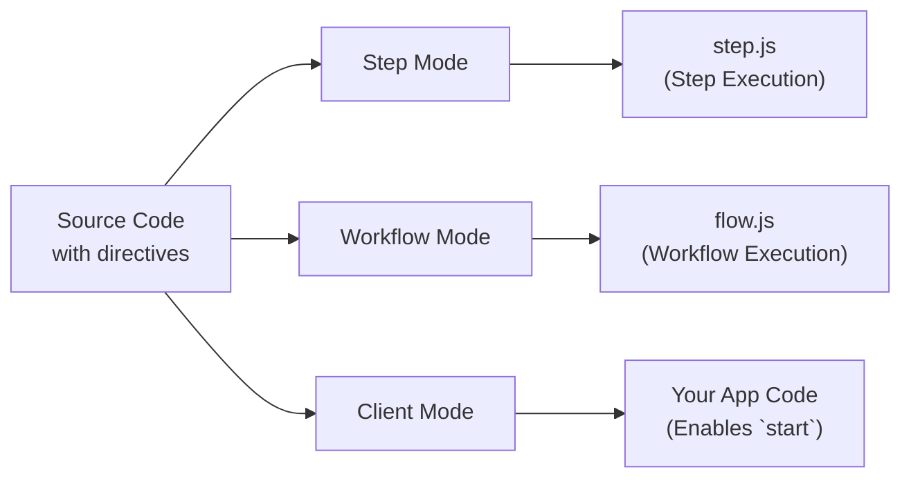

<Callout>
This is an advanced guide that dives into internals of the Workflow DevKit directive and is not required reading to use workflows. To simply use the Workflow DevKit, check out the [getting started](/docs/getting-started) guides for your framework.
</Callout>

Workflows use special directives to mark code for transformation by the Workflow DevKit compiler. This page explains how `"use workflow"` and `"use step"` directives work, what transformations are applied, and why they're necessary for durable execution.


---

## Directives Overview

Workflows use two directives to mark functions for special handling:

```typescript
export async function handleUserSignup(email: string) {
  "use workflow"; // [!code highlight]

  const user = await createUser(email);
  await sendWelcomeEmail(user);

  return { userId: user.id };
}

async function createUser(email: string) {
  "use step"; // [!code highlight]

  return { id: crypto.randomUUID(), email };
}
```

**Key directives:**

- `"use workflow"`: Marks a function as a durable workflow entry point
- `"use step"`: Marks a function as an atomic, retryable step

These directives trigger the `@workflow/swc-plugin` compiler to transform your code in different ways depending on the execution context.

---

## The Three Transformation Modes

The compiler operates in three distinct modes, transforming the same source code differently for each execution context:



### Comparison Table

| Mode     | Used In    | Purpose                        | Output API Route                   | Required? |
|----------|------------|--------------------------------|------------------------------------|-----------|
| Step     | Build time | Bundles step handlers          | `.well-known/workflow/v1/step`  | Yes       |
| Workflow | Build time | Bundles workflow orchestrators | `.well-known/workflow/v1/flow`  | Yes       |
| Client   | Build/Runtime | Provides workflow IDs and types to `start`   | Your application code              | Optional* |

\* Client mode is **recommended** for better developer experience—it provides automatic ID generation and type safety. Without it, you must manually construct workflow IDs or use the build manifest.

---

## Detailed Transformation Examples

<Tabs items={["Step Mode", "Workflow Mode", "Client Mode"]}>
<Tab value="Step Mode">

**Step Mode** creates the step execution bundle served at `/.well-known/workflow/v1/step`.

**Input:**

```typescript
export async function createUser(email: string) {
  "use step";
  return { id: crypto.randomUUID(), email };
}
```

**Output:**

```typescript
import { registerStepFunction } from "workflow/internal/private"; // [!code highlight]

export async function createUser(email: string) {
  return { id: crypto.randomUUID(), email };
}

registerStepFunction("step//workflows/user.js//createUser", createUser); // [!code highlight]
```

**What happens:**

- The `"use step"` directive is removed
- The function body is kept completely intact (no transformation)
- The function is registered with the runtime using `registerStepFunction()`
- Step functions run with full Node.js/Deno/Bun access

**Why no transformation?** Step functions execute in your main runtime with full access to Node.js APIs, file system, databases, etc. They don't need any special handling—they just run normally.

**ID Format:** Step IDs follow the pattern `step//{filepath}//{functionName}`, where the filepath is relative to your project root.

</Tab>
<Tab value="Workflow Mode">

**Workflow Mode** creates the workflow execution bundle served at `/.well-known/workflow/v1/flow`.

**Input:**

```typescript
export async function createUser(email: string) {
  "use step";
  return { id: crypto.randomUUID(), email };
}

export async function handleUserSignup(email: string) {
  "use workflow";
  const user = await createUser(email);
  return { userId: user.id };
}
```

**Output:**

```typescript
export async function createUser(email: string) {
  return globalThis[Symbol.for("WORKFLOW_USE_STEP")]("step//workflows/user.js//createUser")(email); // [!code highlight]
}

export async function handleUserSignup(email: string) {
  const user = await createUser(email);
  return { userId: user.id };
}
handleUserSignup.workflowId = "workflow//workflows/user.js//handleUserSignup"; // [!code highlight]
```

**What happens:**

- Step function bodies are **replaced** with calls to `globalThis[Symbol.for("WORKFLOW_USE_STEP")]`
- Workflow function bodies remain **intact**—they execute deterministically during replay
- The workflow function gets a `workflowId` property for runtime identification
- The `"use workflow"` directive is removed

**Why this transformation?** When a workflow executes, it needs to replay past steps from the event log rather than re-executing them. The `WORKFLOW_USE_STEP` symbol is a special runtime hook that:

1. Checks if the step has already been executed (in the event log)
2. If yes: Returns the cached result
3. If no: Triggers a suspension and enqueues the step for background execution

**ID Format:** Workflow IDs follow the pattern `workflow//{filepath}//{functionName}`. The `workflowId` property is attached to the function to allow [`start()`](/docs/api-reference/workflow-api/start) to work at runtime.

</Tab>
<Tab value="Client Mode">

**Client Mode** transforms workflow functions in your application code to prevent direct execution.

**Input:**

```typescript
export async function handleUserSignup(email: string) {
  "use workflow";
  const user = await createUser(email);
  return { userId: user.id };
}
```

**Output:**

```typescript
export async function handleUserSignup(email: string) {
  throw new Error("You attempted to execute ..."); // [!code highlight]
}
handleUserSignup.workflowId = "workflow//workflows/user.js//handleUserSignup"; // [!code highlight]
```

**What happens:**

- Workflow function bodies are **replaced** with an error throw
- The `workflowId` property is added (same as workflow mode)
- Step functions are not transformed in client mode

**Why this transformation?** Workflow functions cannot be called directly—they must be started using [`start()`](/docs/api-reference/workflow-api/start). The error prevents accidental direct execution while the `workflowId` property allows the `start()` function to identify which workflow to launch.

The IDs are generated exactly like in workflow mode to ensure they can be directly referenced at runtime.

<Callout type="info">
  **Client mode is optional:** While recommended for better developer experience (automatic IDs and type safety), you can skip client mode and instead:
  - Manually construct workflow IDs using the pattern `workflow//{filepath}//{functionName}`
  - Use the workflow manifest file generated during build to lookup IDs
  - Pass IDs directly to `start()` as strings

  All framework integrations include client mode as a loader by default.
</Callout>

</Tab>
</Tabs>

---

## Generated Files

When you build your application, the Workflow DevKit generates three handler files in `.well-known/workflow/v1/`:

### `flow.js`

Contains all workflow functions transformed in **workflow mode**. This file is imported by your framework to handle workflow execution requests at `POST /.well-known/workflow/v1/flow`.

**How it's structured:**

All workflow code is bundled together and embedded as a string inside `flow.js`. When a workflow needs to execute, this bundled code is run inside a **Node.js VM** (virtual machine) to ensure:

- **Determinism**: The same inputs always produce the same outputs
- **Side-effect prevention**: Direct access to Node.js APIs, file system, network, etc. is blocked
- **Sandboxed execution**: Workflow orchestration logic is isolated from the main runtime

**Build-time validation:**

The workflow mode transformation validates your code during the build:

- Catches invalid Node.js API usage (like `fs`, `http`, `child_process`)
- Prevents imports of modules that would break determinism

Most invalid patterns cause **build-time errors**, catching issues before deployment.

**What it does:**

- Exports a `POST` handler that accepts Web standard `Request` objects
- Executes bundled workflow code inside a Node.js VM for each request
- Handles workflow execution, replay, and resumption
- Returns execution results to the orchestration layer

<Callout type="info">
  **Why a VM?** Workflow functions must be deterministic to support replay. The VM sandbox prevents accidental use of non-deterministic APIs or side effects. All side effects should be performed in [step functions](/docs/foundations/workflows-and-steps#step-functions) instead.
</Callout>

### `step.js`

Contains all step functions transformed in **step mode**. This file is imported by your framework to handle step execution requests at `POST /.well-known/workflow/v1/step`.

**What it does:**

- Exports a `POST` handler that accepts Web standard `Request` objects
- Executes individual steps with full runtime access
- Returns step results to the orchestration layer

### `webhook.js`

Contains webhook handling logic for delivering external data to running workflows via [`createWebhook()`](/docs/api-reference/workflow/create-webhook).

**What it does:**

- Exports a `POST` handler that accepts webhook payloads
- Validates tokens and routes data to the correct workflow run
- Resumes workflow execution after webhook delivery

**Note:** The webhook file structure varies by framework. Next.js generates `webhook/[token]/route.js` to leverage App Router's dynamic routing, while other frameworks generate a single `webhook.js` or `webhook.mjs` handler.

---

## Why Three Modes?

The multi-mode transformation enables the Workflow DevKit's durable execution model:

1. **Step Mode** (required) - Bundles executable step functions that can access the full runtime
2. **Workflow Mode** (required) - Creates orchestration logic that can replay from event logs
3. **Client Mode** (optional) - Prevents direct execution and enables type-safe workflow references

This separation allows:

- **Deterministic replay**: Workflows can be safely replayed from event logs without re-executing side effects
- **Sandboxed orchestration**: Workflow logic runs in a controlled VM without direct runtime access
- **Stateless execution**: Your compute can scale to zero and resume from any point in the workflow
- **Type safety**: TypeScript works seamlessly with workflow references (when using client mode)

---

## Determinism and Replay

A key aspect of the transformation is maintaining **deterministic replay** for workflow functions.

**Workflow functions must be deterministic:**

- Same inputs always produce the same outputs
- No direct side effects (no API calls, no database writes, no file I/O)
- Can use seeded random/time APIs provided by the VM (`Math.random()`, `Date.now()`, etc.)

Because workflow functions are deterministic and have no side effects, they can be safely re-run multiple times to calculate what the next step should be. This is why workflow function bodies remain intact in workflow mode—they're pure orchestration logic.

**Step functions can be non-deterministic:**

- Can make API calls, database queries, etc.
- Have full access to Node.js runtime and APIs
- Results are cached in the event log after first execution

Learn more about [Workflows and Steps](/docs/foundations/workflows-and-steps).

---

## ID Generation

The compiler generates stable IDs for workflows and steps based on file paths and function names:

**Pattern:** `{type}//{filepath}//{functionName}`

**Examples:**

- `workflow//workflows/user-signup.js//handleUserSignup`
- `step//workflows/user-signup.js//createUser`
- `step//workflows/payments/checkout.ts//processPayment`

**Key properties:**

- **Stable**: IDs don't change unless you rename files or functions
- **Unique**: Each workflow/step has a unique identifier
- **Portable**: Works across different runtimes and deployments

<Callout type="info">
  Although IDs can change when files are moved or functions are renamed, Workflow DevKit function assume atomic versioning in the World. This means changing IDs won't break old workflows from running, but will prevent run from being upgraded and will cause your workflow/step names to change in the observability across deployments.
</Callout>

---

## Framework Integration

These transformations are framework-agnostic—they output standard JavaScript that works anywhere.

**For users**: Your framework handles all transformations automatically. See the [Getting Started](/docs/getting-started) guide for your framework.

**For framework authors**: Learn how to integrate these transformations into your framework in [Building Framework Integrations](/docs/how-it-works/framework-integrations).

---

## Debugging Transformed Code

If you need to debug transformation issues, you can inspect the generated files:

1. **Look in `.well-known/workflow/v1/`**: Check the generated `flow.js`, `step.js`,`webhook.js`, and other emitted debug files.
2. **Check build logs**: Most frameworks log transformation activity during builds
3. **Verify directives**: Ensure `"use workflow"` and `"use step"` are the first statements in functions
4. **Check file locations**: Transformations only apply to files in configured source directories
