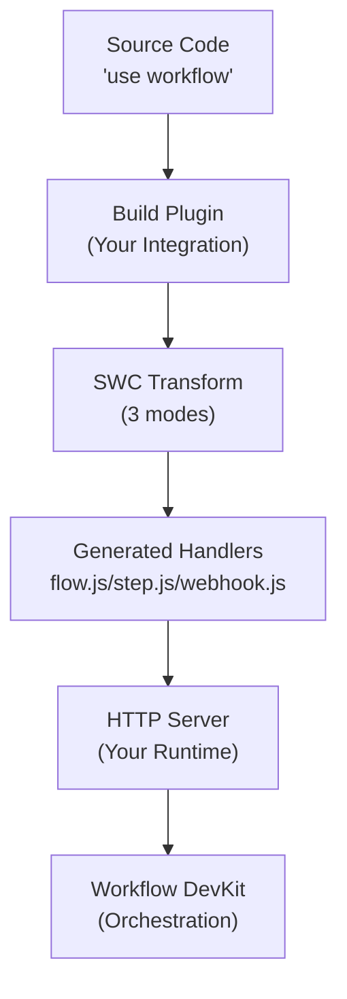

# Building Framework Integrations

<Callout>
  If you just want to use Workflow DevKit with an existing framework, check out the [Getting Started](/docs/getting-started) guide instead. This page is for framework authors who want to integrate Workflow DevKit with their framework or runtime.
</Callout>

This guide walks you through building a framework integration for Workflow DevKit. We'll use Bun as our example, but the same principles apply to any JavaScript runtime (Node.js, Deno, Cloudflare Workers, etc.).

A working example of the integration walkthrough below can be [found here](https://github.com/vercel/workflow-examples/tree/main/custom-adapter). Note that this is just an example—we recommend using official framework integrations when available.

<Callout type="info">
  **Prerequisites:** Before building a framework integration, we recommend reading [How the Directives Work](/docs/how-it-works/code-transform) to understand the transformation system that powers Workflow DevKit.
</Callout>

---

## Architecture Overview

A complete framework integration consists of two main components:

1. **Build-time transformation**: Transform workflow code and generate HTTP handlers
2. **Runtime integration**: Expose HTTP handlers as endpoints in your application server



**The flow:**

1. Your build plugin scans source directories for workflow files
2. Files with `"use workflow"` or `"use step"` directives are transformed
3. Three handler files are generated in `.well-known/workflow/v1/`
4. Your HTTP server exposes these handlers as endpoints
5. Workflow DevKit communicates with these endpoints to orchestrate execution

---

## Part 1: Build-Time Integration

Your framework integration needs to hook into your build process to apply transformations and generate handler files.

### Step 1: Scan Source Directories

Identify where workflow code lives in your framework. For example:

- **Next.js**: `app/` and `pages/` directories
- **Standalone mode**: `workflows/` directory
- **SvelteKit**: `src/routes/` directory

Your build plugin should:
1. Scan these directories for TypeScript/JavaScript files
2. Quickly check if files contain `"use workflow"` or `"use step"` (regex is fine)
3. Only transform files that contain these directives

### Step 2: Apply Transformations

For files containing directives, apply the `@workflow/swc-plugin` transformations:

<Callout type="info">
  Learn more about what each transformation mode does in [How the Directives Work](/docs/how-it-works/code-transform).
</Callout>

**Step mode (required)** - Generates `/.well-known/workflow/v1/step.js`:
```typescript
import { transform } from "@swc/core";

const result = await transform(sourceCode, {
  filename: filePath,
  jsc: {
    experimental: {
      plugins: [
        [require.resolve("@workflow/swc-plugin"), { mode: "step" }],
      ],
    },
  },
});
```

**Workflow mode (required)** - Generates `/.well-known/workflow/v1/flow.js`:
```typescript
const result = await transform(sourceCode, {
  filename: filePath,
  jsc: {
    experimental: {
      plugins: [
        [require.resolve("@workflow/swc-plugin"), { mode: "workflow" }],
      ],
    },
  },
});
```

**Client mode (optional, recommended)** - Transforms your application code:
```typescript
const result = await transform(sourceCode, {
  filename: filePath,
  jsc: {
    experimental: {
      plugins: [
        [require.resolve("@workflow/swc-plugin"), { mode: "client" }],
      ],
    },
  },
});
```

<Callout>
  **Client mode provides better DX:** While optional, client mode is recommended because it:
  - Automatically attaches workflow IDs to functions for use with `start()`
  - Provides TypeScript type safety and autocomplete
  - Prevents accidental direct execution of workflow functions

  Without client mode, developers must manually construct workflow IDs using the pattern `workflow//{filepath}//{functionName}` or reference the build manifest.
</Callout>

### Step 3: Generate Handler Files

Bundle the transformed code into three handler files in `.well-known/workflow/v1/`:

- `flow.js` - Workflow execution handler (from workflow mode)
- `step.js` - Step execution handler (from step mode)
- `webhook.js` (or `webhook.mjs`) - Webhook delivery handler

Each handler exports a `POST` function that accepts a Web standard `Request` object.

<Callout type="info">
  **No Vendor Lock-In**: The generated handlers output standard JavaScript HTTP handler code that works anywhere. This separation means you can deploy workflows to any JavaScript runtime without being locked into a specific platform or provider.
</Callout>

### Build Integration Summary

When running your framework's `build` command, your integration needs to:

1. Scan source directories where workflow code lives
2. Transform files containing workflow directives:
   - Step mode (required) - for step execution
   - Workflow mode (required) - for workflow orchestration
   - Client mode (optional, recommended) - for better developer experience
3. Generate handler files at `.well-known/workflow/v1/*`

---

## Part 2: HTTP Server Integration

Your framework must expose three HTTP endpoints that route to the generated handler files.

<Callout type="info">
  The exact protocol and payload handling is managed by the generated `flow.js`, `step.js`, and `webhook.js` files. Your framework integration only needs to route HTTP requests to these handlers—no need to parse or understand the payloads.
</Callout>

### Required Endpoints

#### 1. Workflow Handler

**Endpoint:** `POST /.well-known/workflow/v1/flow`

**Purpose:** Executes [workflow functions](/docs/foundations/workflows-and-steps#workflow-functions).

**How it works:**

The workflow function is "rendered" multiple times during the lifecycle of a workflow execution. Each time it runs, it progresses through the workflow logic until it encounters the next step that needs to be executed. Because [workflow functions are deterministic and have no side effects](/docs/foundations/workflows-and-steps#workflow-functions), they can be safely re-run multiple times to calculate what the next step should be.

**Called when:**
- Starting a new workflow
- Resuming execution after a step completes
- Resuming after a webhook or hook is triggered
- Recovering from failures

**Interface:**
- **Request**: Web standard `Request` object with binary payload from Workflow DevKit
- **Response**: Web standard `Response` object with binary payload containing execution results

**Example implementation:**

```typescript
import flow from "./.well-known/workflow/v1/flow.js";

server.route("POST", "/.well-known/workflow/v1/flow", (req) => flow.POST(req));
```

#### 2. Step Handler

**Endpoint:** `POST /.well-known/workflow/v1/step`

**Purpose:** Executes [step functions](/docs/foundations/workflows-and-steps#step-functions).

**How it works:**

This endpoint executes individual atomic operations within workflows. Each step runs exactly once per execution (unless it fails and needs to be retried). Steps have full access to the runtime environment (Node.js APIs, file system, databases, etc.).

**Interface:**
- **Request**: Web standard `Request` object with binary payload from Workflow DevKit
- **Response**: Web standard `Response` object with binary payload containing step results

**Example implementation:**

```typescript
import step from "./.well-known/workflow/v1/step.js";

server.route("POST", "/.well-known/workflow/v1/step", (req) => step.POST(req));
```

#### 3. Webhook Handler

**Endpoint:** `POST /.well-known/workflow/v1/webhook/:token`

**Purpose:** Delivers webhook data to running workflows via [`createWebhook()`](/docs/api-reference/workflow/create-webhook).

**How it works:**

This endpoint allows external systems to send data to running workflows. When a workflow calls `createWebhook()`, it generates a unique token that external services can use to deliver data. The webhook handler validates the token, delivers the payload to the correct workflow run, and resumes execution.

**Interface:**
- **Request**: Web standard `Request` object with the webhook payload and token parameter
- **Response**: Web standard `Response` object confirming webhook delivery

**Example implementation (framework-dependent):**

```typescript
// Next.js example - uses App Router's file-based routing
import webhook from "./.well-known/workflow/v1/webhook/[token]/route.js";
// The route is automatically handled by Next.js App Router

// Generic server example - requires route parameter handling
import webhook from "./.well-known/workflow/v1/webhook.js";
server.route("POST", "/.well-known/workflow/v1/webhook/:token", (req) =>
  webhook.POST(req)
);
```

<Callout type="info">
  The generated webhook route structure varies by framework. Next.js generates a file at `webhook/[token]/route.js` to leverage App Router's dynamic routing, while other frameworks may generate a single `webhook.js` or `webhook.mjs` handler that your framework must route with a `:token` parameter.
</Callout>

---

## Complete Example: Bun

Let's walk through a complete integration example using Bun. Bun is unique because it serves as both a **runtime** (needs code transformations) and a **framework** (provides `Bun.serve()` for HTTP routing).

### Overview

Here's what we'll build:

1. **Build script**: Use `workflow` CLI to generate step/workflow mode bundles
2. **Runtime plugin**: Apply client mode transforms at runtime
3. **HTTP server**: Route requests to workflow handlers using `Bun.serve()`

### 1. Building the Handler Routes

The step and workflow mode transformations can be handled by the `workflow` CLI, which looks for a `workflows/` directory by default and creates the handler bundles.

```json title="package.json"
{
  "scripts": {
    "dev": "bun x workflow build && PORT=3152 bun run server.ts"
  }
}
```

<Callout>
  This implementation lacks file system watching for a smooth dev experience. Production framework integrations, like the [Next.js Plugin](https://github.com/vercel/workflow/tree/main/packages/next), are better optimized with hot reloading.
</Callout>

### 2. Runtime Client Transformation

This Bun plugin applies **client mode** transforms to your application code at runtime:

```typescript title="workflow-plugin.ts" lineNumbers
import { plugin } from "bun";
import { transform } from "@swc/core";

plugin({
  name: "workflow-transform",
  setup(build) {
    build.onLoad({ filter: /\.(ts|tsx|js|jsx)$/ }, async (args) => {
      const source = await Bun.file(args.path).text();

      // Optimization: Only transform files with directives
      // False positives are safe (transformation is a no-op)
      if (!source.match(/(use step|use workflow)/)) {
        return { contents: source };
      }

      const result = await transform(source, {
        filename: args.path,
        jsc: {
          experimental: {
            plugins: [
              [require.resolve("@workflow/swc-plugin"), { mode: "client" }], // [!code highlight]
            ],
          },
        },
      });

      return {
        contents: result.code,
        loader: "ts",
      };
    });
  },
});
```

To activate this plugin, add it to your `bunfig.toml`:

```toml title="bunfig.toml"
preload = ["./workflow-plugin.ts"]
```

**What this does:**
- Hooks into Bun's native module loader
- Checks for workflow directives in all TypeScript/JavaScript files
- Only transforms files containing `"use step"` or `"use workflow"`
- Applies client mode transformation (prevents direct workflow execution)

### 3. HTTP Server Routing

Finally, wire up the HTTP endpoints using `Bun.serve()`:

```typescript title="server.ts" lineNumbers
import { start } from "workflow/api";
import flow from "./.well-known/workflow/v1/flow.js";
import step from "./.well-known/workflow/v1/step.js";
import webhook from "./.well-known/workflow/v1/webhook.js";
import { handleUserSignup } from "./workflows/user-signup.js";

const server = Bun.serve({
  port: process.env.PORT,
  routes: {
    "/.well-known/workflow/v1/flow": {
      POST: (req) => flow.POST(req),
    },

    "/.well-known/workflow/v1/step": {
      POST: (req) => step.POST(req),
    },

    "/.well-known/workflow/v1/webhook/:token": {
      POST: (req) => webhook.POST(req),
    },

    "/": {
      GET: async (req) => {
        const email = `test-${crypto.randomUUID()}@test.com`;

        const run = await start(handleUserSignup, [email]);

        return Response.json({
          message: "User signup workflow started",
          runId: run.runId,
        });
      },
    },
  },
});

console.log(`Server listening on http://localhost:${server.port}`);
```

**What this does:**
- Imports generated `flow.js`, `step.js`, and `webhook.js` handlers
- Maps HTTP endpoints to handler functions
- Delegates all POST requests directly to generated handlers
- The webhook route uses a `:token` parameter for identifying workflow runs
- Includes an example endpoint showing how to start a workflow with `start()`

You can find the complete Bun example implementation [here](https://github.com/vercel/workflow-examples/tree/main/custom-adapter).

---

## Security

A natural question when exposing HTTP endpoints is: **how are they secured?**

The security model depends on the **world abstraction** you're using. Different world implementations provide different security mechanisms.

### World-Specific Security

**Vercel (via `@workflow/world-vercel`):**

- Uses Vercel Queue as the backend orchestration layer
- Vercel Queue will soon support **private invoke**, making routes inaccessible from the public internet
- Handlers receive only a **message ID** from the queue, which must be retrieved from Vercel's backend
- This architecture makes it impossible to craft custom payloads—you need valid message IDs from the queue
- Even if someone discovers the endpoint URL, they cannot execute workflows without queue-issued message IDs

**Custom Implementations:**

- World implementations can provide their own security mechanisms
- Add authentication/authorization via framework middleware
- Implement API key verification, JWT validation, or other auth schemes
- Use network-level security (VPCs, private networks, firewall rules)
- Implement rate limiting and request validation

### Best Practices

When building your own world or framework integration, consider:

- **Authentication**: Verify requests come from trusted sources (your orchestration backend, not external clients)
- **Payload validation**: Ensure payloads are cryptographically signed or from a trusted internal system
- **Network isolation**: Run workflow endpoints on private networks when possible
- **Rate limiting**: Protect against abuse even from internal systems

The generated handlers don't include authentication because the security model is delegated to the world abstraction layer, allowing each runtime environment to implement the most appropriate security mechanism for its deployment context.

Learn more about [world abstractions](/docs/deploying/world).

---

## Testing Your Integration

After building your integration, verify it works correctly:

### 1. Test Transformations

Create a simple workflow file and verify transformations:

```typescript title="test/fixtures/simple-workflow.ts"
export async function testWorkflow() {
  "use workflow";
  return await testStep();
}

async function testStep() {
  "use step";
  return "hello";
}
```

Run your build and check:
- `.well-known/workflow/v1/flow.js` contains transformed workflow code
- `.well-known/workflow/v1/step.js` contains step registration
- Your app code has client mode transforms applied

### 2. Test HTTP Endpoints

Start your server and verify endpoints respond:

```bash
# Test that endpoints exist (should return 400/405, not 404)
curl -X POST http://localhost:3000/.well-known/workflow/v1/flow
curl -X POST http://localhost:3000/.well-known/workflow/v1/step
curl -X POST http://localhost:3000/.well-known/workflow/v1/webhook/test-token
```

### 3. Run an End-to-End Workflow

Create a test workflow and execute it:

```typescript
import { start } from "workflow/api";
import { testWorkflow } from "./test/fixtures/simple-workflow";

const run = await start(testWorkflow, []);
console.log("Workflow started:", run.runId);
```

Verify the workflow completes successfully.

---

## Troubleshooting

### Transformations Not Applied

**Symptoms:** Workflow code isn't transformed, or you get errors about missing directives.

**Solutions:**
- Verify files are in scanned source directories
- Check that `"use workflow"` or `"use step"` are the first statements in functions
- Ensure the SWC plugin is correctly configured
- Check build logs for transformation errors

### Routes Return 404

**Symptoms:** POST requests to `.well-known/workflow/v1/*` return 404.

**Solutions:**
- Verify handler files were generated in `.well-known/workflow/v1/`
- Check that your HTTP server is correctly routing to these files
- Ensure the route paths exactly match (including the `v1` version)
- Check for framework-specific routing requirements (e.g., file-based vs code-based)

### Serialization Errors

**Symptoms:** Errors about non-serializable values being passed between workflows/steps.

**Solutions:**
- Only pass JSON-serializable values (primitives, arrays, plain objects)
- Avoid passing functions, class instances, Symbols, or other non-serializable types
- See [Serialization](/docs/foundations/serialization) for details

### Module Resolution Errors

**Symptoms:** Cannot find `workflow/api`, `workflow/internal/private`, etc.

**Solutions:**
- Ensure `@workflow/core` is installed
- Check that your bundler/runtime resolves the `workflow` package correctly
- Verify imports match the expected paths

---

## Publishing Your Integration

If you're building an integration for the community:

### Package Naming

Follow these conventions:
- Framework plugins: `@workflow/{framework-name}` (e.g., `@workflow/remix`)
- Build plugins: `@workflow/{bundler-name}-plugin` (e.g., `@workflow/vite-plugin`)

### Required Exports

Your integration package should export:

- Build plugin/configuration for the framework
- TypeScript types for workflow functions
- Documentation on how to configure and use it

### Documentation

Include:

- Installation instructions
- Configuration guide
- Example projects
- Migration guide (if replacing an existing solution)

---

## Related Documentation

- [How the Directives Work](/docs/how-it-works/code-transform) - Understand the transformation system
- [World Abstractions](/docs/deploying/world) - Learn about storage backends and security
- [Getting Started](/docs/getting-started) - See official integrations in action
- [Workflows and Steps](/docs/foundations/workflows-and-steps) - Core execution concepts
- [Next.js Integration Source](https://github.com/vercel/workflow/tree/main/packages/next) - Reference implementation
