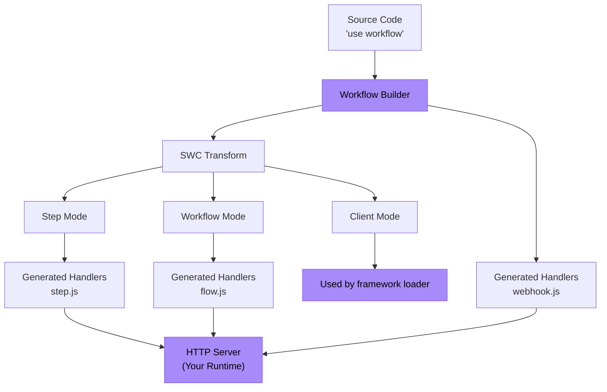

<Callout>
  **For users:** If you just want to use Workflow DevKit with an existing framework, check out the [Getting Started](/docs/getting-started) guide instead. This page is for framework authors who want to integrate Workflow DevKit with their framework or runtime.
</Callout>

This guide walks you through building a framework integration for Workflow DevKit using Bun as a concrete example. The same principles apply to any JavaScript runtime (Node.js, Deno, Cloudflare Workers, etc.).

<Callout type="info">
  **Prerequisites:** Before building a framework integration, we recommend reading [How the Directives Work](/docs/how-it-works/code-transform) to understand the transformation system that powers Workflow DevKit.
</Callout>

---

## What You'll Build

A framework integration has two main components:

1. **Build-time**: Generate workflow handler files (`flow.js`, `step.js`, `webhook.js`)
2. **Runtime**: Expose these handlers as HTTP endpoints in your application server



The purple boxes are what you implement—everything else is provided by Workflow DevKit.

---

## Example: Bun Integration

Let's build a complete integration for Bun. Bun is unique because it serves as both a runtime (needs code transformations) and a framework (provides `Bun.serve()` for HTTP routing).

<Callout type="info">
  A working example can be [found here](https://github.com/vercel/workflow-examples/tree/main/custom-adapter). For a production-ready reference, see the [Next.js integration](https://github.com/vercel/workflow/tree/main/packages/next).
</Callout>

### Step 1: Generate Handler Files

Use the `workflow` CLI to generate the handler bundles. The CLI scans your `workflows/` directory and creates `flow.js`, `step.js`, and `webhook.js`.

```json title="package.json"
{
  "scripts": {
    "dev": "bun x workflow build && PORT=3152 bun run server.ts"
  }
}
```

<Callout>
  **For production integrations:** Instead of using the CLI, extend the `BaseBuilder` class directly in your framework plugin. This gives you control over file watching, custom output paths, and framework-specific hooks. See the [Next.js plugin](https://github.com/vercel/workflow/tree/main/packages/next) for an example.
</Callout>

**What gets generated:**

- `/.well-known/workflow/v1/flow.js` - Handles workflow execution (workflow mode transform)
- `/.well-known/workflow/v1/step.js` - Handles step execution (step mode transform)
- `/.well-known/workflow/v1/webhook.js` - Handles webhook delivery

Each file exports a `POST` function that accepts Web standard `Request` objects.

### Step 2: Add Client Mode Transform (Optional)

Client mode transforms your application code to provide better DX. Add a Bun plugin to apply this transformation at runtime:

```typescript title="workflow-plugin.ts" lineNumbers
import { plugin } from "bun";
import { transform } from "@swc/core";

plugin({
  name: "workflow-transform",
  setup(build) {
    build.onLoad({ filter: /\.(ts|tsx|js|jsx)$/ }, async (args) => {
      const source = await Bun.file(args.path).text();

      // Optimization: Skip files that do not have any directives
      if (!source.match(/(use step|use workflow)/)) {
        return { contents: source };
      }

      const result = await transform(source, {
        filename: args.path,
        jsc: {
          experimental: {
            plugins: [
              [require.resolve("@workflow/swc-plugin"), { mode: "client" }], // [!code highlight]
            ],
          },
        },
      });

      return { contents: result.code, loader: "ts" };
    });
  },
});
```

Activate the plugin in `bunfig.toml`:

```toml title="bunfig.toml"
preload = ["./workflow-plugin.ts"]
```

**What this does:**

- Attaches workflow IDs to functions for use with `start()`
- Provides TypeScript type safety
- Prevents accidental direct execution of workflows

**Why optional?** Without client mode, you can still use workflows by manually constructing IDs or referencing the build manifest.

### Step 3: Expose HTTP Endpoints

Wire up the generated handlers to HTTP endpoints using `Bun.serve()`:

```typescript title="server.ts" lineNumbers
import flow from "./.well-known/workflow/v1/flow.js";
import step from "./.well-known/workflow/v1/step.js";
import * as webhook from "./.well-known/workflow/v1/webhook.js";

import { start } from "workflow/api";
import { handleUserSignup } from "./workflows/user-signup.js";

const server = Bun.serve({
  port: process.env.PORT,
  routes: {
    "/.well-known/workflow/v1/flow": {
      POST: (req) => flow.POST(req),
    },
    "/.well-known/workflow/v1/step": {
      POST: (req) => step.POST(req),
    },
    // webhook exports handlers for GET, POST, DELETE, etc.
    "/.well-known/workflow/v1/webhook/:token": webhook,

    // Example: Start a workflow
    "/": {
      GET: async (req) => {
        const email = `test-${crypto.randomUUID()}@test.com`;
        const run = await start(handleUserSignup, [email]);
        return Response.json({
          message: "User signup workflow started",
          runId: run.runId,
        });
      },
    },
  },
});

console.log(`Server listening on http://localhost:${server.port}`);
```

**That's it!** Your Bun integration is complete.

---

## Understanding the Endpoints

Your integration must expose three HTTP endpoints. The generated handlers manage all protocol details—you just route requests.

### Workflow Endpoint

**Route:** `POST /.well-known/workflow/v1/flow`

Executes workflow orchestration logic. The workflow function is "rendered" multiple times during execution—each time it progresses until it encounters the next step.

**Called when:**

- Starting a new workflow
- Resuming after a step completes
- Resuming after a webhook or hook triggers
- Recovering from failures

### Step Endpoint

**Route:** `POST /.well-known/workflow/v1/step`

Executes individual atomic operations within workflows. Each step runs exactly once per execution (unless retried due to failure). Steps have full runtime access (Node.js APIs, file system, databases, etc.).

### Webhook Endpoint

**Route:** `POST /.well-known/workflow/v1/webhook/:token`

Delivers webhook data to running workflows via [`createWebhook()`](/docs/api-reference/workflow/create-webhook). The `:token` parameter identifies which workflow run should receive the data.

<Callout type="info">
  The webhook file structure varies by framework. Next.js generates `webhook/[token]/route.js` to leverage App Router's dynamic routing, while other frameworks generate a single `webhook.js` handler.
</Callout>

---

## Adapting to Other Frameworks

The Bun example demonstrates the core pattern. To adapt for your framework:

### Build-Time

**Option 1: Use the CLI** (simplest)

```bash
workflow build
```

This will default to scanning the `./workflows` top-level directory for workflow files, and will output bundled files directly into your working directory.

**Option 2: Extend `BaseBuilder`** (recommended)

```typescript lineNumbers
import { BaseBuilder } from '@workflow/cli/dist/lib/builders/base-builder';

class MyFrameworkBuilder extends BaseBuilder {
  constructor(options) {
    super({
      dirs: ['workflows'],
      workingDir: options.rootDir,
      watch: options.dev,
    });
  }

  override async build(): Promise<void> {
    const inputFiles = await this.getInputFiles();

    await this.createWorkflowsBundle({
      outfile: '/path/to/.well-known/workflow/v1/flow.js',
      format: 'esm',
      inputFiles,
    });

    await this.createStepsBundle({
      outfile: '/path/to/.well-known/workflow/v1/step.js',
      format: 'esm',
      inputFiles,
    });

    await this.createWebhookBundle({
      outfile: '/path/to/.well-known/workflow/v1/webhook.js',
    });
  }
}
```

If your framework supports virtual server routes and dev mode watching, make sure to adapt accordingly. Please open a PR to the Workflow DevKit if the base builder class is missing necessary functionality.

Hook into your framework's build:

```typescript title="pseudocode.ts" lineNumbers
framework.hooks.hook('build:before', async () => {
  await new MyFrameworkBuilder(framework).build();
});
```

### Runtime (Client Mode)

Add a loader/plugin for your bundler:

**Rollup/Vite:**

```typescript lineNumbers
export function workflowPlugin() {
  return {
    name: 'workflow-client-transform',
    async transform(code, id) {
      if (!code.match(/(use step|use workflow)/)) return null;

      const result = await transform(code, {
        filename: id,
        jsc: {
          experimental: {
            plugins: [[require.resolve("@workflow/swc-plugin"), { mode: "client" }]], // [!code highlight]
          },
        },
      });

      return { code: result.code, map: result.map };
    },
  };
}
```

**Webpack:**

```javascript lineNumbers
module.exports = {
  module: {
    rules: [
      {
        test: /\.(ts|tsx|js|jsx)$/,
        use: 'workflow-client-loader', // Similar implementation
      },
    ],
  },
};
```

### HTTP Server

Route the three endpoints to the generated handlers. The exact implementation depends on your framework's routing API.

In the bun example above, we left routing to the user. Essentially, the user has to serve routes like this:

```typescript title="server.ts" lineNumbers
import flow from "./.well-known/workflow/v1/flow.js";
import step from "./.well-known/workflow/v1/step.js";
import * as webhook from "./.well-known/workflow/v1/webhook.js";

// Expose the 3 generated routes
const server = Bun.serve({
  routes: {
    "/.well-known/workflow/v1/flow": {
      POST: (req) => flow.POST(req),
    },
    "/.well-known/workflow/v1/step": {
      POST: (req) => step.POST(req),
    },
    // webhook exports handlers for GET, POST, DELETE, etc.
    "/.well-known/workflow/v1/webhook/:token": webhook,
  },
});
```

Production framework integrations should handle this routing in the plugin instead of leaving it to the user, and this depends on each framework's unique implementaiton.
Check the Workflow DevKit source code for examples of production framework implementations.
In the future, the Workflow DevKit will emit more routes under the `.well-known/workflow` namespace.

---

## Security

**How are these HTTP endpoints secured?**

Security is handled by the **world abstraction** you're using:

**Vercel (`@workflow/world-vercel`):**

- Vercel Queue will support private invoke, making routes inaccessible from the public internet
- Handlers receive only a message ID that must be retrieved from Vercel's backend
- Impossible to craft custom payloads without valid queue-issued message IDs

**Custom implementations:**

- Implement authentication via framework middleware
- Use API keys, JWT validation, or other auth schemes
- Network-level security (VPCs, private networks, firewall rules)
- Rate limiting and request validation

Learn more about [world abstractions](/docs/deploying/world).

---

## Testing Your Integration

### 1. Test Build Output

Create a test workflow:

```typescript title="workflows/test.ts" lineNumbers
import { sleep, createWebhook } from "workflow";

export async function handleUserSignup(email: string) {
  "use workflow";

  const user = await createUser(email);
  await sendWelcomeEmail(user);

  await sleep("5s");

  const webhook = createWebhook();
  await sendOnboardingEmail(user, webhook.url);

  await webhook;
  console.log("Webhook Resolved");

  return { userId: user.id, status: "onboarded" };
}

async function createUser(email: string) {
  "use step";

  console.log(`Creating a new user with email: ${email}`);

  return { id: crypto.randomUUID(), email };
}

async function sendWelcomeEmail(user: { id: string; email: string }) {
  "use step";

  console.log(`Sending welcome email to user: ${user.id}`);
}

async function sendOnboardingEmail(user: { id: string; email: string }, callback: string) {
  "use step";

  console.log(`Sending onboarding email to user: ${user.id}`);

  console.log(`Click this link to resolve the webhook: ${callback}`);
}

```

Run your build and verify:

- `.well-known/workflow/v1/flow.js` exists
- `.well-known/workflow/v1/step.js` exists
- `.well-known/workflow/v1/webhook.js` exists

### 2. Test HTTP Endpoints

Start your server and verify routes respond:

```bash
curl -X POST http://localhost:3000/.well-known/workflow/v1/flow
curl -X POST http://localhost:3000/.well-known/workflow/v1/step
curl -X POST http://localhost:3000/.well-known/workflow/v1/webhook/test
```

(Should respond but not trigger meaningful code without authentication/proper workflow run)

### 3. Run a Workflow End-to-End

```typescript
import { start } from "workflow/api";
import { handleUserSignup } from "./workflows/test";

const run = await start(handleUserSignup, ["test@example.com"]);
console.log("Workflow started:", run.runId);
```
