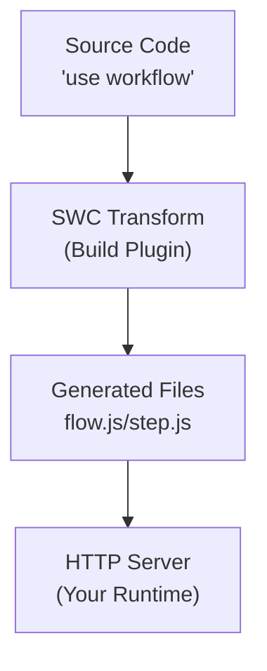

# Framework Integrations

<Callout>
  The goal for Workflow DevKit is to have official adapters for everywhere you
  need to run workflows. Go to the [getting started](/docs/getting-started)
  guide to pick your framework and get started.
</Callout>

If you're interested in learning how Workflow integrates with frameworks and how you can build your own framework integration, read on. We'll walk through building the Bun framework integration together and explain the underlying architecture of how the Workflow DevKit integrates with different JavaScript runtimes. While this example uses Bun, the same principles apply to writing framework integrations for any JavaScript runtime (Node.js, Deno, Cloudflare Workers, etc.).

A working example of the bun integration walkthrough below can be [found here](https://github.com/vercel/workflow-examples/tree/main/custom-adapter). Note that this is just an example, and we recommend the official bun integration that is currently in development.

---

## Overview

The Workflow DevKit architecture is as follows:

1. **Build-time transformation**: Workflow code is transformed by a framework agnostic compiler plugin
2. **Generated handlers**: The build process generates HTTP handlers in `.well-known/workflow/v1/` bundled with your step, workflow, and webhook code (flow.js, step.js, and webhook.js)
3. **Runtime integration**: Your application server exposes these handlers as HTTP endpoints ([learn about how security is handled](#security))
4. **Execution orchestration**: The Workflow DevKit communicates with these endpoints to orchestrate durable execution



---

## Writing a Framework Integration

To integrate Workflow DevKit with a runtime, you need two main components: a build-time transformation hook and HTTP server integration. Let's walk through each one.

### Transformation

Workflows use directives to mark code for transformation:

```typescript
export async function handleUserSignup(email: string) {
  "use workflow"; // [!code highlight]

  const user = await createUser(email);
  await sendWelcomeEmail(user);

  return { userId: user.id };
}

async function createUser(email: string) {
  "use step"; // [!code highlight]

  return { id: crypto.randomUUID(), email };
}
```

**Key directives:**

- `"use workflow"`: Marks a function as a durable workflow entry point
- `"use step"`: Marks a function as an atomic, retryable step

**How the transformation works:**

The `@workflow/swc-plugin` operates in three modes, transforming code differently for each bundle:

<Tabs items={["Step Mode", "Workflow Mode", "Client Mode"]}>
<Tab value="Step Mode">

**Step Mode** creates the step execution bundle served at `/.well-known/workflow/v1/step`.

**Input:**

```typescript
export async function createUser(email: string) {
  "use step";
  return { id: crypto.randomUUID(), email };
}
```

**Output:**

```typescript
import { registerStepFunction } from "workflow/internal/private"; // [!code highlight]

export async function createUser(email: string) {
  return { id: crypto.randomUUID(), email };
}

registerStepFunction("step//workflows/user.js//createUser", createUser); // [!code highlight]
```

The directive is removed from step functions, and they're registered with the runtime using `registerStepFunction()`.

Step bodies are kept intact since they just run in the main runtime (Node, Deno, Bun, etc.). There's no transformation here.

**ID Format:** Step IDs follow the pattern `step//{filepath}//{functionName}`, where the filepath is relative to your project root.

</Tab>
<Tab value="Workflow Mode">

**Workflow Mode** creates the workflow execution bundle served at `/.well-known/workflow/v1/flow`.

**Input:**

```typescript
export async function createUser(email: string) {
  "use step";
  return { id: crypto.randomUUID(), email };
}

export async function handleUserSignup(email: string) {
  "use workflow";
  const user = await createUser(email);
  return { userId: user.id };
}
```

**Output:**

```typescript
export async function createUser(email: string) {
  return globalThis[Symbol.for("WORKFLOW_USE_STEP")]("step//workflows/user.js//createUser")(email); // [!code highlight]
}

export async function handleUserSignup(email: string) {
  const user = await createUser(email);
  return { userId: user.id };
}
handleUserSignup.workflowId = "workflow//workflows/user.js//handleUserSignup"; // [!code highlight]
```

Step function bodies are replaced with calls to `globalThis[Symbol.for("WORKFLOW_USE_STEP")]`, which handles replaying the step result from the event log, or trigger a suspension that enqueues the step in the background.

Workflow function bodies remain intact—they're executed deterministically during replay. The directive simply gets dropped, and a workflow ID is added to the function to allow [`start`](/docs/api-reference/workflow-api/start) to work at runtime.

**ID Format:** Workflow IDs follow the pattern `workflow//{filepath}//{functionName}`. The `workflowId` property is attached to the function for runtime identification.

</Tab>
<Tab value="Client Mode">

**Client Mode** transforms workflow functions in your application code to prevent direct execution.

**Input:**

```typescript
export async function handleUserSignup(email: string) {
  "use workflow";
  const user = await createUser(email);
  return { userId: user.id };
}
```

**Output:**

```typescript
export async function handleUserSignup(email: string) {
  throw new Error("You attempted to execute ..."); // [!code highlight]
}
handleUserSignup.workflowId = "workflow//workflows/user.js//handleUserSignup"; // [!code highlight]
```

Workflow functions throw errors to prevent direct execution—you must use [`start()`](/docs/api-reference/workflow-api/start) instead.

The IDs are generated exactly like in workflow mode to ensure they can be directly referenced at runtime.

</Tab>
</Tabs>

When running your framework's `build` command, the corresponding workflow integration simply needs to:

1. Scan directories where the framework's source code typically lives (for example, `app/` and `pages/` in Next.js)
2. Transform files containing workflow directives (`"use workflow"` or `"use step"`)
3. Generate handler files for the framework to expose at `.well-known/workflow/v1/*`

<Callout type="info">
  **No Vendor Lock-In**: Everything here is completely agnostic from the world
  abstraction and runtime environment. It outputs standard JavaScript HTTP
  handler code that works anywhere. This separation means you can deploy your
  workflows to any JavaScript runtime without being locked into a specific
  platform or provider.
</Callout>

### HTTP Server Integration

Your framework integration must expose three HTTP endpoints that correspond to the generated handler files.

<Callout type="info">
  The exact protocol and payload handling is managed by the generated `flow.js`,
  `step.js`, and `webhook.js` files. Your framework integration only needs to route HTTP requests to these
  handlers.
</Callout>

#### Workflow Handler

**Endpoint:** `POST /.well-known/workflow/v1/flow`

Handles [workflow function](/docs/foundations/workflows-and-steps#workflow-functions) execution.

**How it works:**

The workflow function is "rendered" multiple times during the lifecycle of a workflow execution. Each time it runs, it progresses through the workflow logic until it encounters the next step that needs to be executed. Because [workflow functions are deterministic and have no side effects](/docs/foundations/workflows-and-steps#workflow-functions), they can be safely re-run multiple times to calculate what the next step should be.

**Called when:**

- Starting a new workflow
- Resuming execution after a step completes
- Resuming after a webhook or hook is triggered
- Recovering from failures

**Interface:**

- **Request**: Web standard `Request` object with binary payload from Workflow DevKit
- **Response**: Web standard `Response` object with binary payload containing execution results

**Example implementation:**

```typescript
import flow from "./.well-known/workflow/v1/flow.js";

server.route("POST", "/.well-known/workflow/v1/flow", (req) => flow.POST(req));
```

#### Step Handler

**Endpoint:** `POST /.well-known/workflow/v1/step`

Handles [step function](/docs/foundations/workflows-and-steps#step-functions) execution.

**How it works:**

This endpoint executes individual atomic operations within workflows. Each step runs exactly once per execution (unless it fails and needs to be retried).

**Interface:**

- **Request**: Web standard `Request` object with binary payload from Workflow DevKit
- **Response**: Web standard `Response` object with binary payload containing step results

**Example implementation:**

```typescript
import step from "./.well-known/workflow/v1/step.js";

server.route("POST", "/.well-known/workflow/v1/step", (req) => step.POST(req));
```

#### Webhook Handler

**Endpoint:** `POST /.well-known/workflow/v1/webhook/:token`

Handles webhook delivery to running workflows via [`createWebhook()`](/docs/api-reference/workflow/create-webhook).

**How it works:**

This endpoint allows external systems to send data to running workflows. When a workflow calls `createWebhook()`, it generates a unique token that external services can use to deliver data. The webhook handler validates the token, delivers the payload to the correct workflow run, and resumes execution.

**Interface:**

- **Request**: Web standard `Request` object with the webhook payload and token parameter
- **Response**: Web standard `Response` object confirming webhook delivery

**Example implementation (framework-dependent):**

```typescript
// Next.js example
import webhook from "./.well-known/workflow/v1/webhook/[token]/route.js";

// The route is automatically handled by Next.js App Router

// Nitro example
import webhook from "./.well-known/workflow/v1/webhook.mjs";

server.route("POST", "/.well-known/workflow/v1/webhook/:token", (req) => webhook.POST(req));
```

<Callout type="info">
  The generated webhook route structure varies by framework. Next.js generates a file at `webhook/[token]/route.js` to leverage App Router's dynamic routing, while other frameworks may generate a single `webhook.js` or `webhook.mjs` handler that your framework must route to with a `:token` parameter.
</Callout>

---

## Security

A natural question when exposing these HTTP endpoints is: how are they secured?

The answer depends on the **world abstraction** you're using. Different world implementations provide different security mechanisms:

### World-Specific Security

**Vercel (via `@workflow/world-vercel`):**

- Uses Vercel Queue as the backend orchestration layer
- Vercel Queue will soon support **private invoke**, making these routes not publicly accessible from the internet
- The handler receives only a **message ID** from the queue, which must be retrieved from the Vercel Queue backend
- This architecture makes it impossible to craft custom payloads and directly invoke the endpoints with arbitrary data
- Even if someone discovers the endpoint URL, they cannot execute workflows without valid message IDs from the queue system

**Custom Implementations:**

- Different world implementations can implement their own security measures
- Framework middleware can add authentication and authorization layers
- You can implement API key verification, JWT validation, or other authentication schemes
- You can use network-level security (VPCs, private networks, firewall rules)
- You can implement rate limiting and request validation

### Best Practices

When building your own world or framework integration, consider:

- **Authentication**: Verify that requests come from trusted sources (your orchestration backend, not external clients)
- **Payload validation**: Ensure request payloads are cryptographically signed or come from a trusted internal system
- **Network isolation**: Run workflow endpoints on private networks when possible
- **Rate limiting**: Protect against abuse even from internal systems

The generated handlers themselves don't include authentication because the security model is delegated to the world abstraction layer, allowing each runtime environment to implement the most appropriate security mechanism for its deployment context.

---

## Reference Implementation: Bun

Bun is a special case because it serves as both a **runtime** and a **framework**:

- **Runtime**: Bun needs transformations applied to compile workflow code
- **Framework**: `Bun.serve()` handles HTTP routing and request handling

Here's how the bun example handles building the routes, implementing the client transform at runtime, and serves the routes from the right HTTP endpoints.

### 1. Building the routes

In this example, running the Step and Workflow mode transform actually happens using the `workflow` CLI. `workflow build` will, by default, look for a `workflows/` directory and will create the "step" and "workflow" bundles.
So in this example, the `package.json` simply invokes workflow build before running the bun server.

```json title="package.json"
{
  // ...
  "scripts": {
    "dev": "bun x workflow build && PORT=3152 bun run server.ts"
  }
}
```

<Callout>
  This implementation notably lacks file system watching for a local dev experience. Production framework implementations, like the [Next Plugin](https://github.com/vercel/workflow/tree/main/packages/next) are better optimized for this.
</Callout>

### 2. Runtime Client Transformation

This transformation applies to the **Bun runtime** to resolve workflow code during the build process:

```typescript title="workflow-plugin.ts" lineNumbers
import { plugin } from "bun";
import { transform } from "@swc/core";

plugin({
  name: "workflow-transform",
  setup(build) {
    build.onLoad({ filter: /\.(ts|tsx|js|jsx)$/ }, async (args) => {
      const source = await Bun.file(args.path).text();

      // Optimization: we can speed up the plugin by only transforming files
      // that make use of the directive. False positives are safe.
      if (!source.match(/(use step|use workflow)/)) {
        return { contents: source };
      }

      const result = await transform(source, {
        filename: args.path,
        jsc: {
          experimental: {
            plugins: [
              [require.resolve("@workflow/swc-plugin"), { mode: "client" }], // [!code highlight]
            ],
          },
        },
      });

      return {
        contents: result.code,
        loader: "ts",
      };
    });
  },
});
```

To run this plugin in bun, add it to your `bunfig.toml` file:

```toml title="bunfig.toml"
preload = ["./workflow-plugin.ts"]
```

**Key aspects:**

- Uses Bun's native `plugin()` API to hook into the build process
- Checks for workflow directives in all TypeScript and JavaScript files
- Only transforms files that contain `"use step"` or `"use workflow"`
- Applies SWC transformation with workflow plugin
- Returns transformed code with TypeScript loader

### 3. HTTP Routing

This integration uses **`Bun.serve()`** as the framework to route HTTP requests to the workflow handlers:

```typescript title="server.ts" lineNumbers
import { start } from "workflow/api";
import flow from "./.well-known/workflow/v1/flow.js";
import step from "./.well-known/workflow/v1/step.js";
import webhook from "./.well-known/workflow/v1/webhook.js";
import { handleUserSignup } from "./workflows/user-signup.js";

const server = Bun.serve({
  port: process.env.PORT,
  routes: {
    "/.well-known/workflow/v1/flow": {
      POST: (req) => flow.POST(req),
    },

    "/.well-known/workflow/v1/step": {
      POST: (req) => step.POST(req),
    },

    "/.well-known/workflow/v1/webhook/:token": {
      POST: (req) => webhook.POST(req),
    },

    "/": {
      GET: async (req) => {
        const email = `test-${crypto.randomUUID()}@test.com`;

        const run = await start(handleUserSignup, [email]);

        return Response.json({
          message: "User signup workflow started",
          runId: run.runId,
        });
      },
    },
  },
});

console.log(`Server listening on http://localhost:${server.port}`);
```

**Key aspects:**

- Imports generated `flow.js`, `step.js`, and `webhook.js` handlers
- Uses `Bun.serve()`'s routing API to map HTTP endpoints to handlers
- Delegates POST requests directly to generated handlers
- The webhook route uses a `:token` parameter to identify which workflow run should receive the webhook
- The framework handles request routing; the runtime handles code execution
- Example endpoint shows how to start a workflow using `start()`

You can find the complete bun example implementation [here](https://github.com/vercel/workflow-examples/tree/main/custom-adapter).
