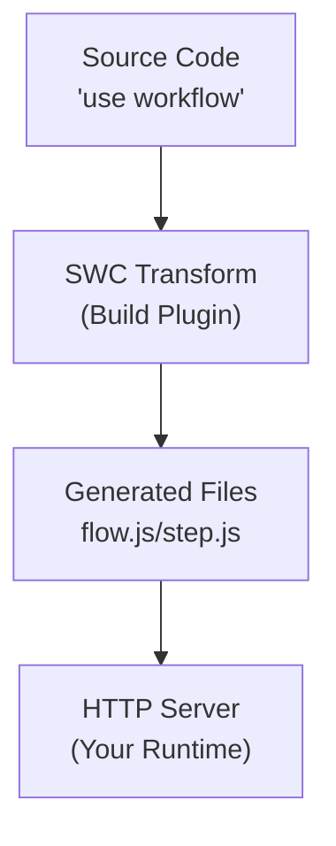

# Framework Integrations

<Callout>
  The goal for Workflow DevKit is to have official adapters for everywhere you
  need to run workflows. Go to the [getting started](/docs/getting-started)
  guide to pick your framework and get started.
</Callout>

If you're interested in learning how Workflow integrates with frameworks and how you can build your own adapter, read on. We'll walk through building the Bun adapter together and explain the underlying architecture of how the Workflow DevKit integrates with different JavaScript runtimes. While this example uses Bun, the same principles apply to writing adapters for any JavaScript runtime (Node.js, Deno, Cloudflare Workers, etc.).

---

## Overview

The Workflow DevKit architecture is as follows:

1. **Build-time transformation**: Workflow code is transformed by a framework agnostic compiler plugin
2. **Generated handlers**: The build process generates HTTP handlers in `.well-known/workflow/v1/` bundled with your step, workflow, and webhook code
3. **Runtime integration**: Your application server exposes these handlers as HTTP endpoints ([learn about how security is handled](#security))
4. **Execution orchestration**: The Workflow DevKit communicates with these endpoints to orchestrate durable execution



---

## Writing a Runtime Adapter

To integrate Workflow DevKit with a runtime, you need two main components: a build-time transformation hook and HTTP server integration. Let's walk through each one.

### Transformation

Workflows use special directives to mark code for transformation:

```typescript
export async function handleUserSignup(email: string) {
  "use workflow";

  const user = await createUser(email);
  await sendWelcomeEmail(user);

  return { userId: user.id };
}

async function createUser(email: string) {
  "use step";

  return { id: crypto.randomUUID(), email };
}
```

**Key directives:**

- `"use workflow"`: Marks a function as a durable workflow entry point
- `"use step"`: Marks a function as an atomic, retryable step

**How the transformation works:**

The `@workflow/swc-plugin` transforms these functions into instrumented code that:

- Captures function calls and their arguments
- Generates serialization/deserialization logic
- Creates step boundaries for durability
- Produces execution graphs

When you run `workflow build`, the framework adapter:

1. Scans directories where the framework's source code typically lives (for example, `app/`, `pages/`, `src/app/`, or `src/pages/` in Next.js)
2. Transforms files containing workflow directives (`"use workflow"` or `"use step"`)
3. Generates handler files for the framework to expose at `.well-known/workflow/v1/*`

<Callout type="info">
  **No Vendor Lock-In**: `workflow build` is completely agnostic from the world
  abstraction and runtime environment. It outputs standard JavaScript HTTP
  handler code that works anywhere. This separation means you can deploy your
  workflows to any JavaScript runtime without being locked into a specific
  platform or provider.
</Callout>

**What you need to implement:**

- A plugin/loader hook in your runtime's build system
- Detection of workflow directives (`"use workflow"` or `"use step"`) in source files
- SWC transformation with `@workflow/swc-plugin`
- Module loading/resolution

**Example pattern:**

```typescript
buildSystem.plugin({
  name: "workflow-transform",
  setup(build) {
    build.onLoad({ filter: /\.(ts|tsx|js|jsx)$/ }, async (args) => {
      const source = await readFile(args.path);

      if (!source.match(/(use step|use workflow)/)) {
        return { contents: source };
      }

      const result = await transform(source, {
        filename: args.path,
        jsc: {
          experimental: {
            plugins: [
              [require.resolve("@workflow/swc-plugin"), { mode: "client" }],
            ],
          },
        },
      });

      return {
        contents: result.code,
        loader: "ts",
      };
    });
  },
});
```

### HTTP Server Integration

Your runtime adapter must expose two HTTP endpoints that correspond to the generated handler files.

<Callout type="info">
  The exact protocol and payload handling is managed by the generated `flow.js`
  and `step.js` files. Your adapter only needs to route HTTP requests to these
  handlers.
</Callout>

#### Workflow Handler

**Endpoint:** `POST /.well-known/workflow/v1/flow`

Handles [workflow function](/docs/foundations/workflows-and-steps#workflow-functions) execution.

**How it works:**

The workflow function is "rendered" multiple times during the lifecycle of a workflow execution. Each time it runs, it progresses through the workflow logic until it encounters the next step that needs to be executed. Because [workflow functions are deterministic and have no side effects](/docs/foundations/workflows-and-steps#workflow-functions), they can be safely re-run multiple times to calculate what the next step should be.

**Called when:**

- Starting a new workflow
- Resuming execution after a step completes
- Resuming after a webhook or hook is triggered
- Recovering from failures

**Interface:**

- **Request**: Web standard `Request` object with binary payload from Workflow DevKit
- **Response**: Web standard `Response` object with binary payload containing execution results

**Example implementation:**

```typescript
import flow from "./.well-known/workflow/v1/flow.js";

server.route("POST", "/.well-known/workflow/v1/flow", (req) => flow.POST(req));
```

#### Step Handler

**Endpoint:** `POST /.well-known/workflow/v1/step`

Handles [step function](/docs/foundations/workflows-and-steps#step-functions) execution.

**How it works:**

This endpoint executes individual atomic operations within workflows. Each step runs exactly once per execution (unless it fails and needs to be retried).

**Interface:**

- **Request**: Web standard `Request` object with binary payload from Workflow DevKit
- **Response**: Web standard `Response` object with binary payload containing step results

**Example implementation:**

```typescript
import step from "./.well-known/workflow/v1/step.js";

server.route("POST", "/.well-known/workflow/v1/step", (req) => step.POST(req));
```

---

## Security

A natural question when exposing these HTTP endpoints is: how are they secured?

The answer depends on the **world abstraction** you're using. Different world implementations provide different security mechanisms:

### World-Specific Security

**Vercel (via `@workflow/world-vercel`):**

- Uses Vercel Queue as the backend orchestration layer
- Vercel Queue will soon support **private invoke**, making these routes not publicly accessible from the internet
- The handler receives only a **message ID** from the queue, which must be retrieved from the Vercel Queue backend
- This architecture makes it impossible to craft custom payloads and directly invoke the endpoints with arbitrary data
- Even if someone discovers the endpoint URL, they cannot execute workflows without valid message IDs from the queue system

**Custom Implementations:**

- Different world implementations can implement their own security measures
- Framework middleware can add authentication and authorization layers
- You can implement API key verification, JWT validation, or other authentication schemes
- You can use network-level security (VPCs, private networks, firewall rules)
- You can implement rate limiting and request validation

### Best Practices

When building your own world or adapter, consider:

- **Authentication**: Verify that requests come from trusted sources (your orchestration backend, not external clients)
- **Payload validation**: Ensure request payloads are cryptographically signed or come from a trusted internal system
- **Network isolation**: Run workflow endpoints on private networks when possible
- **Rate limiting**: Protect against abuse even from internal systems

The generated handlers themselves don't include authentication because the security model is delegated to the world abstraction layer, allowing each runtime environment to implement the most appropriate security mechanism for its deployment context.

---

## Reference Implementation: Bun

Bun is a special case because it serves as both a **runtime** and a **framework**:

- **Runtime**: Bun needs transformations applied to compile workflow code
- **Framework**: `Bun.serve()` handles HTTP routing and request handling

Here's how both components are implemented:

### 1. Runtime Transformation

This transformation applies to the **Bun runtime** to resolve workflow code during the build process:

```typescript
import { plugin } from "bun";
import { transform } from "@swc/core";

plugin({
  name: "workflow-transform",
  setup(build) {
    build.onLoad({ filter: /\.(ts|tsx|js|jsx)$/ }, async (args) => {
      const source = await Bun.file(args.path).text();

      if (!source.match(/(use step|use workflow)/)) {
        return { contents: source };
      }

      const result = await transform(source, {
        filename: args.path,
        jsc: {
          experimental: {
            plugins: [
              [require.resolve("@workflow/swc-plugin"), { mode: "client" }],
            ],
          },
        },
      });

      return {
        contents: result.code,
        loader: "ts",
      };
    });
  },
});
```

**Key aspects:**

- Uses Bun's native `plugin()` API to hook into the build process
- Checks for workflow directives in all TypeScript and JavaScript files
- Only transforms files that contain `"use step"` or `"use workflow"`
- Uses `Bun.file()` for file reading
- Applies SWC transformation with workflow plugin
- Returns transformed code with TypeScript loader

### 2. HTTP Routing

This integration uses **`Bun.serve()`** as the framework to route HTTP requests to the workflow handlers:

```typescript
import { start } from "workflow/api";
import flow from "./.well-known/workflow/v1/flow.js";
import step from "./.well-known/workflow/v1/step.js";
import { handleUserSignup } from "./workflows/user-signup.js";

const server = Bun.serve({
  port: process.env.PORT,
  routes: {
    "/.well-known/workflow/v1/flow": {
      POST: (req) => flow.POST(req),
    },

    "/.well-known/workflow/v1/step": {
      POST: (req) => step.POST(req),
    },

    "/": {
      GET: async (req) => {
        const email = `test-${crypto.randomUUID()}@test.com`;

        const run = await start(handleUserSignup, [email]);

        return Response.json({
          message: "User signup workflow started",
          runId: run.runId,
        });
      },
    },
  },
});

console.log(`Server listening on http://localhost:${server.port}`);
```

**Key aspects:**

- Imports generated `flow.js` and `step.js` handlers
- Uses `Bun.serve()`'s routing API to map HTTP endpoints to handlers
- Delegates POST requests directly to generated handlers
- The framework handles request routing; the runtime handles code execution
- Example endpoint shows how to start a workflow using `start()`

### Example Workflow Definition

```typescript
import { sleep, FatalError } from "workflow";

export async function handleUserSignup(email: string) {
  "use workflow";

  const user = await createUser(email);
  await sendWelcomeEmail(user);

  await sendOnboardingEmail(user);

  return { userId: user.id, status: "onboarded" };
}

async function createUser(email: string) {
  "use step";

  console.log(`Creating a new user with email: ${email}`);

  return { id: crypto.randomUUID(), email };
}

async function sendWelcomeEmail(user: { id: string; email: string }) {
  "use step";

  console.log(`Sending welcome email to user: ${user.id}`);
}

async function sendOnboardingEmail(user: { id: string; email: string }) {
  "use step";

  console.log(`Sending onboarding email to user: ${user.id}`);
}
```

**Key aspects:**

- `"use workflow"` marks the main workflow function
- `"use step"` marks individual atomic operations
- Steps can be retried independently
- Return values flow between steps
- Type-safe arguments and returns
