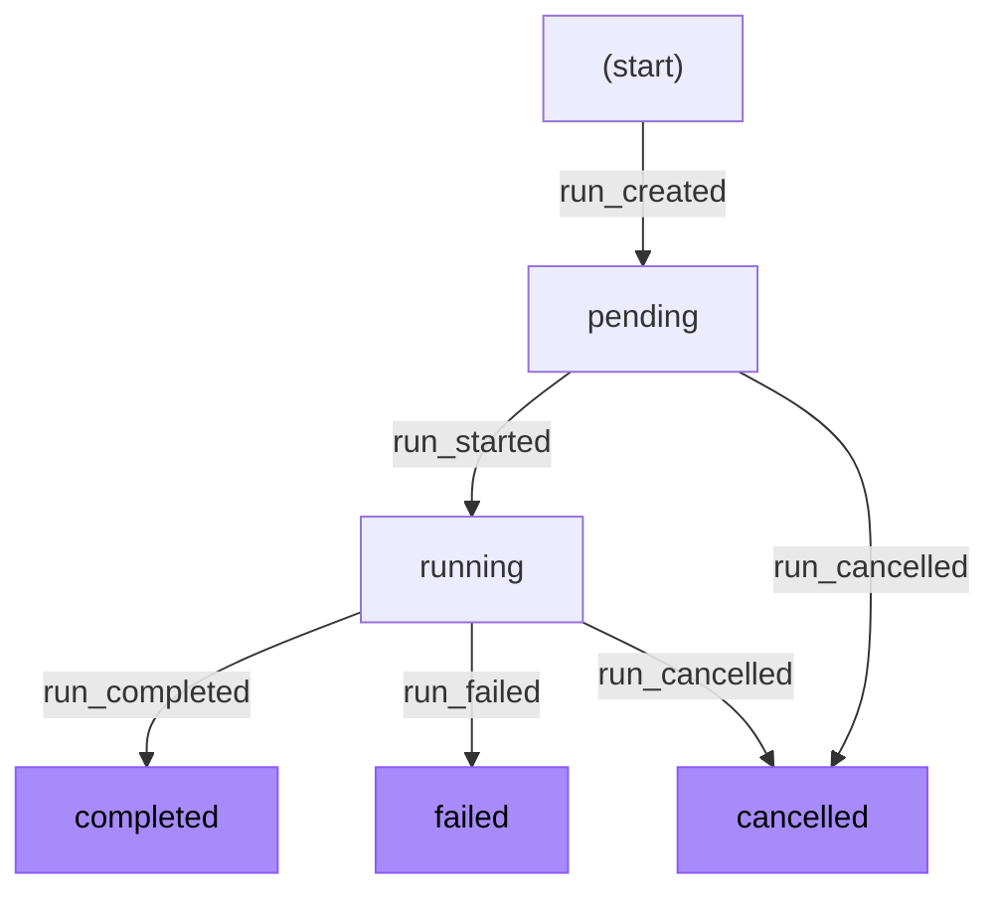
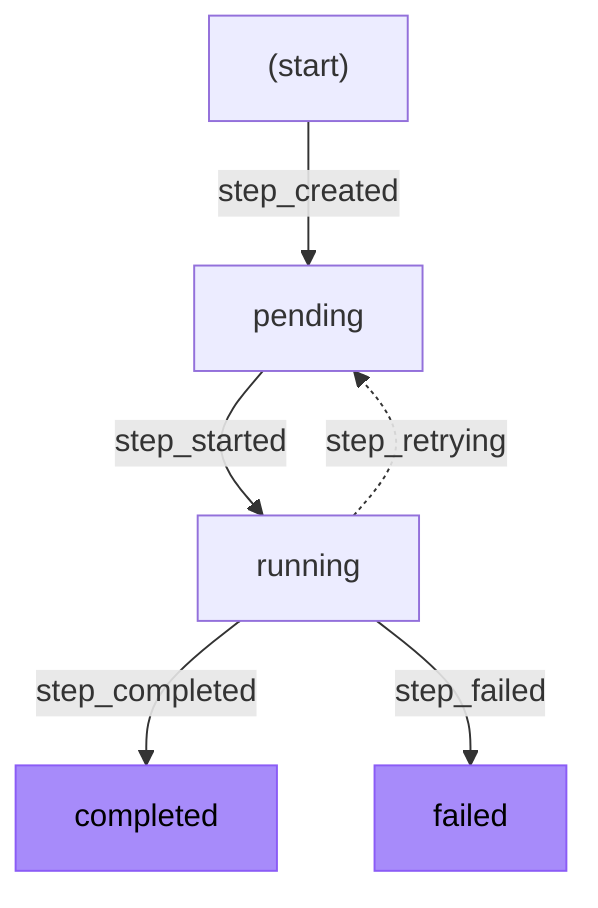
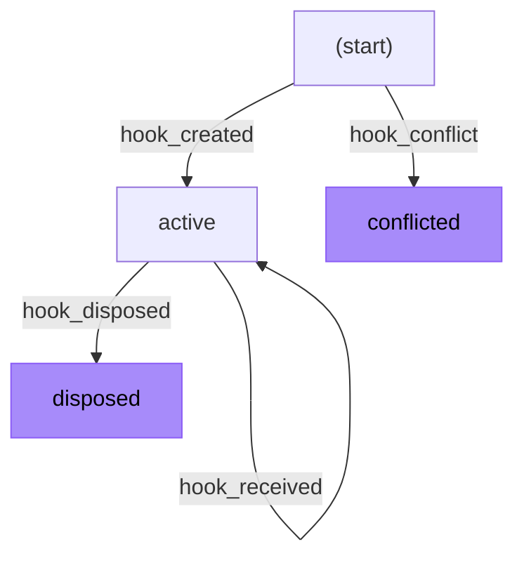
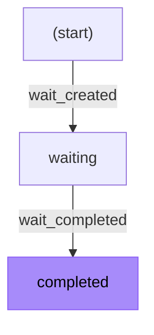

<Callout>
Workflow SDK uses event sourcing internally for debugging and observability tools. To start using workflows, see the [getting started](/docs/getting-started) guide for your framework.
</Callout>

The Workflow SDK uses event sourcing to track all state changes in workflow executions. Every mutation creates an event that is persisted to the event log, and entity state is derived by replaying these events.

## Event sourcing overview

Event sourcing is a persistence pattern where state changes are stored as a sequence of events rather than by updating records in place. The current state of any entity is reconstructed by replaying its events from the beginning.

**Benefits for durable workflows:**

- **Complete audit trail**: Every state change is recorded with its timestamp and context
- **Debugging**: Replay the exact sequence of events that led to any state
- **Consistency**: Events provide a single source of truth for all entity state
- **Recoverability**: State can be reconstructed from the event log after failures

In the Workflow SDK, the following entity types are managed through events:

- **Runs**: Workflow execution instances (materialized in storage)
- **Steps**: Individual atomic operations within a workflow (materialized in storage)
- **Hooks**: Suspension points that can receive external data (materialized in storage)
- **Waits**: Sleep or delay operations (materialized in storage)

## Entity lifecycles

Each entity type follows a specific lifecycle defined by the events that can affect it. Events transition entities between states. Once an entity reaches a terminal state, no further transitions are possible.

<Callout type="info">
In the diagrams below, <span style={{color: '#8b5cf6', fontWeight: 'bold'}}>purple nodes</span> indicate terminal states that cannot be transitioned out of.
</Callout>

### Run lifecycle

A run represents a single execution of a workflow function. Runs begin in `pending` state when created, transition to `running` when execution starts, and end in one of three terminal states.



**Run states:**

- `pending`: Created but not yet executing
- `running`: Actively executing workflow code
- `completed`: Finished successfully with an output value
- `failed`: Terminated due to an unrecoverable error
- `cancelled`: Explicitly canceled by the user or system

### Step lifecycle

A step represents a single invocation of a step function. Steps can retry on failure, either transitioning back to `pending` via `step_retrying` or being re-executed directly with another `step_started` event.



**Step states:**

- `pending`: Created but not yet executing, or waiting to retry
- `running`: Actively executing step code
- `completed`: Finished successfully with a result value
- `failed`: Terminated after exhausting all retry attempts
- `cancelled`: Reserved for future use (not currently emitted)

<Callout type="info">
The `step_retrying` event is optional. Steps can retry without it, regardless of whether the event is emitted. You may see consecutive `step_started` events when a step retries after a timeout, when the error isn't explicitly captured, or when concurrent replays each commit one. See [Duplicate events](#duplicate-events) and [Errors and retries](/docs/foundations/errors-and-retries) for more information.
</Callout>

When present, the `step_retrying` event moves a step back to `pending` state and records the error that caused the retry. This provides two benefits:

- **Cleaner observability**: The event log explicitly shows retry transitions rather than consecutive `step_started` events
- **Error history**: The error that triggered the retry is preserved for debugging

### Hook lifecycle

A hook represents a suspension point that can receive external data, created by [`createHook()`](/docs/api-reference/workflow/create-hook). Hooks enable workflows to pause and wait for external events, user interactions, or HTTP requests. Webhooks (created with [`createWebhook()`](/docs/api-reference/workflow/create-webhook)) are a higher-level abstraction built on hooks that adds automatic HTTP request/response handling.

Hooks can receive multiple payloads while active and are disposed when no longer needed.



**Hook states:**

- `active`: Ready to receive payloads
- `disposed`: No longer accepting payloads
- `conflicted`: Hook creation failed because the token is already in use by another workflow

Unlike other entities, hooks don't have a `status` field. The states above are conceptual. When a `hook_disposed` event is created, the hook record is removed rather than updated.

While a hook is active, its token is reserved and cannot be used by other workflows. If a workflow attempts to create a hook with a token reserved by another run, either by an active hook or by `experimental_minRetention` after its run ended, a `hook_conflict` event is recorded instead of `hook_created`. Current Worlds include the token and the run ID that owns it, though older persisted events or World implementations may only include the token. This causes `hook.getConflict()` to resolve with the conflicting run and the hook's payload promise to reject with a `HookConflictError`, which you can detect with `HookConflictError.is(error)`. See the [hook-conflict error](/docs/errors/hook-conflict) documentation for more details.

When a workflow ends, its hooks can no longer be resumed. They are normally removed, and their tokens become available again. With `experimental_minRetention`, a hook remains readable, and its token remains unavailable until retention ends. A `hook_disposed` event removes the hook and makes its token available immediately.

See [Hooks and webhooks](/docs/foundations/hooks) for more on how hooks and webhooks work.

### Wait lifecycle

A wait represents a sleep operation created by [`sleep()`](/docs/api-reference/workflow/sleep). Waits track when a delay period has elapsed.



**Wait states:**

- `waiting`: Delay period has not yet elapsed
- `completed`: Delay period has elapsed, workflow can resume

<Callout type="info">
Like runs, steps, and hooks, waits are materialized as entities in storage. Processing a `wait_created` event creates a wait entity with the `waiting` status. Processing a `wait_completed` event atomically transitions the wait entity to `completed`. This process guarantees that a wait can only be completed once, even if multiple concurrent invocations attempt to complete it simultaneously.
</Callout>

## Event types reference

Events are categorized by the entity type they affect. Each event contains metadata including a timestamp and a `correlationId` that links the event to a specific entity:

- Step events use the `stepId` as the correlation ID
- Hook events use the `hookId` as the correlation ID
- Wait events use the `waitId` as the correlation ID
- Run events do not require a correlation ID since the `runId` itself identifies the entity

### Run events

| Event | Description |
|-------|-------------|
| `run_created` | Creates a new workflow run in `pending` state. Contains the deployment ID, workflow name, input arguments, and optional execution context. |
| `run_started` | Transitions the run to `running` state when execution begins. |
| `run_completed` | Transitions the run to `completed` state with the workflow's return value. |
| `run_failed` | Transitions the run to `failed` state with error details and optional error code. |
| `run_cancelled` | Transitions the run to `cancelled` state. Can be triggered from `pending` or `running` states. |

### Step events

| Event | Description |
|-------|-------------|
| `step_created` | Creates a new step in `pending` state. Contains the step name and serialized input arguments. |
| `step_started` | Transitions the step to `running` state. Includes the current attempt number for retries. |
| `step_completed` | Transitions the step to `completed` state with the step's return value. |
| `step_failed` | Transitions the step to `failed` state with error details. The step will not be retried. |
| `step_retrying` | (Optional) Transitions the step back to `pending` state for retry. Contains the error that caused the retry and optional delay before the next attempt. When not emitted, retries appear as consecutive `step_started` events. |

### Hook events

| Event | Description |
|-------|-------------|
| `hook_created` | Creates a new hook in `active` state. Contains the hook token and optional metadata. |
| `hook_conflict` | Records that hook creation failed because another run owns the token. Contains the token and, for current worlds, the owner's run ID. The hook is not created: `hook.getConflict()` resolves with the conflicting run, and awaiting the hook payload rejects with a `HookConflictError`. |
| `hook_received` | Records that a payload was delivered to the hook. The hook remains `active` and can receive more payloads. |
| `hook_disposed` | Deletes the hook from storage (conceptually transitioning to `disposed` state). The token is released for reuse by future workflows. |

### Wait events

| Event | Description |
|-------|-------------|
| `wait_created` | Creates a new wait in `waiting` state. Contains the timestamp when the wait should complete. |
| `wait_completed` | Transitions the wait to `completed` state when the delay period has elapsed. |

### System events

| Event | Description |
|-------|-------------|
| `noop` | Seals an abandoned log position (`specVersion` 7 and above). Only the backend writes this event; the create endpoints reject it. See [Sealed positions](#sealed-positions-noop-events). |

## Terminal states

Terminal states represent the end of an entity's lifecycle. Once an entity reaches a terminal state, no further events can transition it to another state.

**Run terminal states:**

- `completed`: Workflow finished successfully
- `failed`: Workflow encountered an unrecoverable error
- `cancelled`: Workflow was explicitly canceled

**Step terminal states:**

- `completed`: Step finished successfully
- `failed`: Step failed after all retry attempts

**Hook terminal states:**

- `disposed`: Hook has been deleted from storage and is no longer active
- `conflicted`: Hook creation failed due to token conflict (hook was never created)

**Wait terminal states:**

- `completed`: Delay period has elapsed

Attempting to create an event that would transition an entity out of a terminal state will result in an error. This prevents inconsistent state and ensures the integrity of the event log.

That guard sits on the write path. Replay handles duplicates that the write path permits, such as a second `step_created` for a step that isn't terminal.

## Duplicate events

Concurrent invocations replaying the same run share one event log. An invocation working from a stale prefix that predates another invocation's write can commit its own `step_created`, `step_started`, or `wait_created` for an entity that already has one in the log. These writes pass the terminal-state guard, so the write path commits them even when a backend validates transitions atomically with the insert.

Those duplicates are committed but inert. The outcome was decided by the first event of its kind at a lower position in the log, and every replay reads that same event at that same position, so a later copy cannot change what the workflow observes.

To prevent an inert copy from failing an otherwise healthy run, the runtime groups event types into **classes**. For each entity, it tracks which classes the current replay has consumed. If no registered consumer accepts an event and its class is already recorded for that entity, replay skips it instead of reporting a [replay divergence](/docs/errors/replay-divergence). After exhausting the recovery budget, a replay divergence ends the run with [`CORRUPTED_EVENT_LOG`](/docs/errors/corrupted-event-log).

| Class | Event types |
|-------|-------------|
| `run_started` | `run_started` |
| `step_created` | `step_created` |
| `step_started` | `step_started` |
| `step_retrying` | `step_retrying` |
| `step_terminal` | `step_completed`, `step_failed` |
| `wait_created` | `wait_created` |
| `wait_completed` | `wait_completed` |
| `hook_created` | `hook_created` |
| `hook_disposed` | `hook_disposed` |

Types that share a class are the mutually exclusive outcomes of one decision. A step either completes or fails, and the first recorded outcome counts. Classes are independent, so skipping one doesn't suppress another. A step whose result is already in the log has still recorded exactly one `step_created`, making a second one independently ignorable.

The two hook classes cover the same shape of duplicate, and replay reaches them less often because the write path resolves most hook duplicates before they reach the log: a run re-creating a hook it already owns converges on the existing `hook_created` rather than appending a second one, and a second `hook_disposed` for the same hook is refused as an idempotent no-op. A log that holds either anyway is read past like any other repeat.

The remaining event types belong to no class and are never skipped:

- `hook_received`: a hook legitimately receives many payloads under one ID, so a second `hook_received` is not a repeat of anything.
- `hook_conflict`: records a failed acquisition of a hook's token, which the same run can hit repeatedly over its lifetime as other runs take and release that token. The hook's own consumer stays registered and claims every copy it is offered, so a repeat is consumed rather than reaching the class check.
- `attr_set`: written on every [`setAttributes()`](/docs/api-reference/workflow/set-attributes) call, so a second write of the same key is a new fact rather than a repeat.
- `run_created` precedes every replay and is always consumed.
- `run_completed`, `run_failed`, and `run_cancelled` never reach the check. The runtime exits before replaying the workflow body once the log holds one of them, so no consumer ever takes one and no class is ever recorded for them.

Both kinds of skip are logged at `debug`, so neither reaches the console unless you run with `DEBUG=workflow:runtime:*`. A duplicate is a permanent part of the log. Every later replay reads it and reaches the same check, so an unconditional message would print once per replay for the life of the run without requiring action. A repeat that decides a class differently, such as a `step_failed` after a `step_completed` or the reverse, gets its own message. Unlike a recommit of the same outcome, both writers cannot be correct.

The observability UI grays out events it can identify this way and shows the reason on hover. Its set is narrower than the runtime's because it reads the log without consumer state. A consumer for an entity that is still open can legitimately claim a repeat because each step retry writes another `step_started`. The UI marks a repeat only when no consumer can remain for it: after a terminal event for the same entity or at a second `run_started`, of which the log records one per run. The UI marks nothing on a partial log view, such as one page of a paginated list or search results, because identifying the first copy requires the entire log.

## Sealed positions (noop events)

Runs at `specVersion` 7 and above use a *sealed log*. The backend gives each write its position from a per-run sequencer **before** the write commits, so concurrent writers hold distinct positions and never race for a slot. New runs use this behavior by default. [`WORKFLOW_SEALED_LOG=0`](/docs/configuration/runtime-tuning#workflow_sealed_log) returns a deployment to the previous scheme. Every runtime reads a sealed log regardless, and a run's version is fixed at creation, so changing the setting never affects an in-flight run. However, a writer can claim a position and then stop because of a crashed process or canceled transaction. This leaves a hole that no writer will fill, and a hole looks like an event the reader failed to load.

The backend restores the dense log at read time by **sealing** these positions. Once a hole is provably abandoned, bounded by the commit time of later positions, the backend writes a `noop` event into it. Positions are assigned in order, so a committed later position proves how long the hole has been open. A `noop` occupies its position, and length-based completeness checks, cursors, and pagination all count it. It has no other effect:

- It is **never offered to any consumer** during replay. The walk steps over it in the same synchronous pass that delivers the events around it, so its presence cannot perturb delivery order, promise scheduling, or which branch of a `Promise.all` resumes first.
- It **never advances the deterministic clock**. A `noop`'s `createdAt` is the *sealer's* wall clock and can postdate events at higher positions. Allowing it to feed the replay clock would make a log containing a seal replay differently from one whose original writer filled the hole. This behavior uses the same rule and mechanism as skipped duplicates.
- Its `correlationId` is `noop_` followed by the sealed position's zero-padded digits. This deterministic format ensures that two sealers racing for the same hole create an identical event that is recognizable in the log.

A sealed position races its original writer at the same uniqueness fence as every other write. Losing that race means the real event landed first, so readers receive it instead. A live writer that gets sealed over derives a new position and commits there, using the same recovery as any other lost write race. Sealing can require a retry but cannot produce an incorrect log.

`noop` is not user-creatable: it does not exist in the create schemas, and backends reject it on every create endpoint. Only a backend's own read path writes one.

## Event correlation

Events use a `correlationId` to link related events together. For step, hook, and wait events, the correlation ID identifies the specific entity instance:

- Step events share the same `correlationId` (the step ID) across all events for that step execution
- Hook events share the same `correlationId` (the hook ID) across all events for that hook
- Wait events share the same `correlationId` (the wait ID) across creation and completion

Run events do not require a correlation ID since the `runId` itself provides the correlation.

This correlation enables:

- Querying all events for a specific step, hook, or wait
- Building timelines of entity lifecycle transitions
- Debugging by tracing the complete history of any entity

### Request ID correlation

Some `World` implementations also attach a `requestId` to events for platform-log correlation. This is different from `correlationId`:

- `correlationId` links together events for the same entity lifecycle
- `requestId` tells you which inbound platform request created or updated the event

On Vercel, `requestId` is the platform request ID when available. Other worlds are not expected to provide a `requestId`.

```json
{
  "eventType": "step_started",
  "correlationId": "step_01JQEXAMPLE1234567890",
  "requestId": "iad1::abc123-1712345678901-xyz987"
}
```

## Entity IDs

All entities in the Workflow SDK use a consistent ID format: a 4-character prefix followed by an underscore and a fixed-width body. For every entity except events, that body is a [ULID](https://github.com/ulid/spec) (Universally Unique Lexicographically Sortable Identifier). An event's body is its slot number, described below.

| Entity | Prefix | Example |
|--------|--------|---------|
| Run | `wrun_` | `wrun_01HXYZ123ABC456DEF789GHJ` |
| Step | `step_` | `step_01HXYZ123ABC456DEF789GHJ` |
| Hook | `hook_` | `hook_01HXYZ123ABC456DEF789GHJ` |
| Wait | `wait_` | `wait_01HXYZ123ABC456DEF789GHJ` |
| Event | `evnt_` | `evnt_00000000000000000000000042` (slot 42) |
| Stream | `strm_` | `strm_01HXYZ123ABC456DEF789GHJ` |

**Why this format?**

- **Prefixes enable introspection**: Given any ID, you can immediately identify what type of entity it refers to. This helps you debug, log, and cross-reference entities across the system.

- **Fixed-width bodies enable ordering**: Unlike UUIDs, these bodies sort lexicographically in creation order, so the event log is stored and retrieved in the correct order by sorting IDs alone. Slot numbers get that from counting at a fixed width, which makes string order the same as numeric order. ULIDs get it from the timestamp in their first 48 bits, which also makes a ULID's creation time recoverable from the ID itself.

### Event IDs

An event ID is a **slot number**: the event's 1-based position in the run's event log, zero-padded to the same width as a ULID. The world assigns it when the event is published, so two writers racing to append never claim the same position and a rejected write leaves no gap behind. Slots are dense, and unique only within a run, so an event ID identifies an event only when paired with its `runId`.

Density is what lets a reader tell a complete log from an incomplete one by its length alone. A replay that loads a log with a position missing below the highest one it can see cannot tell an event that was never written from one it failed to read, so it fails the run with [`CORRUPTED_EVENT_LOG`](/docs/errors/corrupted-event-log) rather than replay across the hole. See [`WORKFLOW_SLOT_GAP_CHECK`](/docs/configuration/runtime-tuning#workflow_slot_gap_check).

A slot ID carries no timestamp. Zero-padded decimal digits are a subset of the ULID alphabet, so a slot ID passes ULID validation and sorts correctly, but decoding its first 48 bits yields the Unix epoch instead of a creation time. Read `createdAt` on the event when you need to know when it was written, and don't decode the time from an `evnt_` ID you get back from an API, a log line, or a cursor.
