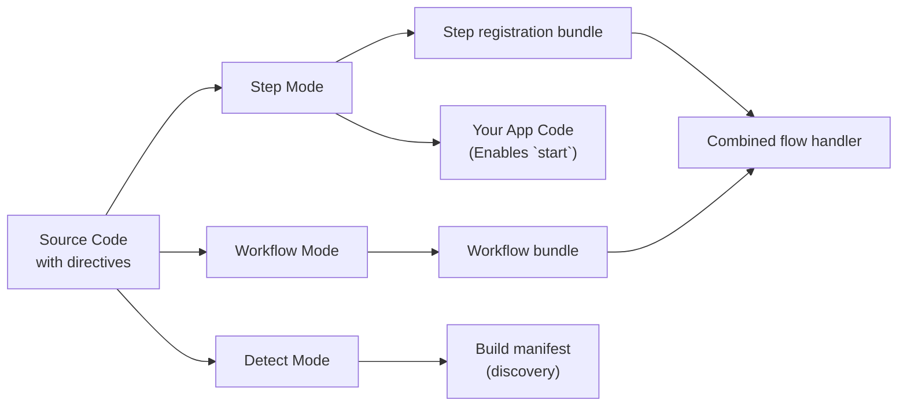

<Callout>
This is an advanced guide that dives into internals of the Workflow SDK directive and is not required reading to use workflows. To simply use the Workflow SDK, check out the [getting started](/docs/getting-started) guides for your framework.
</Callout>

Workflows use special directives to mark code for transformation by the Workflow SDK compiler. This page explains how `"use workflow"` and `"use step"` directives work, what transformations are applied, and why they're necessary for durable execution.

## Directives Overview

Workflows use two directives to mark functions for special handling:

{/* @skip-typecheck: incomplete code sample */}
```typescript
export async function handleUserSignup(email: string) {
  "use workflow"; // [!code highlight]

  const user = await createUser(email);
  await sendWelcomeEmail(user);

  return { userId: user.id };
}

async function createUser(email: string) {
  "use step"; // [!code highlight]

  return { id: crypto.randomUUID(), email };
}
```

**Key directives:**

- `"use workflow"`: Marks a function as a durable workflow entry point
- `"use step"`: Marks a function as an atomic, retryable step

These directives trigger the `@workflow/swc-plugin` compiler to transform your code in different ways depending on the execution context.

## The Three Transformation Modes

The compiler operates in three distinct modes, transforming the same source code differently for each execution context:



### Comparison Table

| Mode     | Used In    | Purpose                        | Runtime role | Required? |
|----------|------------|--------------------------------|--------------|-----------|
| Step     | Build time + your app code | Registers executable step functions; gives app code workflow IDs for `start()` | Imported by the combined flow handler, and applied to application code by the framework loader | Yes |
| Workflow | Build time | Bundles workflow orchestrators | Executed by `.well-known/workflow/v1/flow` | Yes |
| Detect   | Build time | Discovers workflows, steps, and serialization classes without transforming code | Feeds the build's discovery phase and manifest | Yes (build-internal) |

<Callout type="info">
  Earlier releases had a separate **client mode** for application code. In 5.0 it merged into step mode, which produces the same app-code behavior (workflow functions throw on direct calls and carry `workflowId` for `start()`) while also registering step functions. Build integrations that passed `mode: "client"` now pass `mode: "step"`.
</Callout>

## Detailed Transformation Examples

<Tabs items={["Step Mode", "Workflow Mode", "Detect Mode"]}>
<Tab value="Step Mode">

**Step Mode** creates the registration bundle that the combined flow handler imports (it is not an HTTP route), and is also the transform framework loaders apply to your application code.

**Input:**

{/* @skip-typecheck: incomplete code sample */}
```typescript
export async function createUser(email: string) {
  "use step";
  return { id: crypto.randomUUID(), email };
}

export async function handleUserSignup(email: string) {
  "use workflow";
  const user = await createUser(email);
  return { userId: user.id };
}
```

**Output:**

{/* @skip-typecheck: incomplete code sample */}
```typescript
export async function createUser(email: string) {
  return { id: crypto.randomUUID(), email };
}
(function(__wf_fn, __wf_id) { // [!code highlight]
    var __wf_sym = Symbol.for("@workflow/core//registeredSteps"), __wf_reg = globalThis[__wf_sym] || (globalThis[__wf_sym] = new Map()); // [!code highlight]
    __wf_reg.set(__wf_id, __wf_fn); // [!code highlight]
    __wf_fn.stepId = __wf_id; // [!code highlight]
})(createUser, "step//workflows/user.js//createUser"); // [!code highlight]

export async function handleUserSignup(email: string) {
  throw new Error("You attempted to execute ..."); // [!code highlight]
}
handleUserSignup.workflowId = "workflow//workflows/user.js//handleUserSignup"; // [!code highlight]
```

**What happens:**

- The `"use step"` directive is removed
- Step function bodies are kept completely intact (no transformation)
- Each step function is registered with the runtime via an inline IIFE (no imports needed)
- Step functions run with full Node.js/Deno/Bun access
- Workflow function bodies are **replaced** with an error throw, and a `workflowId` property is attached — workflow functions must be launched with [`start()`](/docs/api-reference/workflow-api/start), never called directly, and the ID is what `start()` uses to identify the workflow
- A dead-code-elimination pass removes code reachable only from the replaced workflow bodies

**Why no step transformation?** Step functions execute in your main runtime with full access to Node.js APIs, file system, databases, etc. They don't need any special handling—they just run normally.

**ID Format:** Step IDs follow the pattern `step//{filepath}//{functionName}`, where the filepath is relative to your project root.

</Tab>
<Tab value="Workflow Mode">

**Workflow Mode** creates the workflow execution bundle served at `/.well-known/workflow/v1/flow`.

**Input:**

{/* @skip-typecheck: incomplete code sample */}
```typescript
export async function createUser(email: string) {
  "use step";
  return { id: crypto.randomUUID(), email };
}

export async function handleUserSignup(email: string) {
  "use workflow";
  const user = await createUser(email);
  return { userId: user.id };
}
```

**Output:**

{/* @skip-typecheck: incomplete code sample */}
```typescript
export async function createUser(email: string) {
  return globalThis[Symbol.for("WORKFLOW_USE_STEP")]("step//workflows/user.js//createUser")(email); // [!code highlight]
}

export async function handleUserSignup(email: string) {
  const user = await createUser(email);
  return { userId: user.id };
}
handleUserSignup.workflowId = "workflow//workflows/user.js//handleUserSignup"; // [!code highlight]
```

**What happens:**

- Step function bodies are **replaced** with calls to `globalThis[Symbol.for("WORKFLOW_USE_STEP")]`
- Workflow function bodies remain **intact**—they execute deterministically during replay
- The workflow function gets a `workflowId` property for runtime identification
- The `"use workflow"` directive is removed

**Why this transformation?** When a workflow executes, it needs to replay past steps from the [event log](/docs/how-it-works/event-sourcing) rather than re-executing them. The `WORKFLOW_USE_STEP` symbol is a special runtime hook that:

1. Checks if the step has already been executed (in the event log)
2. If yes: Returns the cached result
3. If no: Suspends the replay and executes the step — usually inline in the same invocation, with the run only handed back to the queue when the invocation's inline budget is exhausted or its timeout approaches

**ID Format:** Workflow IDs follow the pattern `workflow//{filepath}//{functionName}`. The `workflowId` property is attached to the function to allow [`start()`](/docs/api-reference/workflow-api/start) to work at runtime.

</Tab>
<Tab value="Detect Mode">

**Detect Mode** is a lightweight, non-transforming mode used during the build's discovery phase.

**Input:**

{/* @skip-typecheck: incomplete code sample */}
```typescript
export async function handleUserSignup(email: string) {
  "use workflow";
  const user = await createUser(email);
  return { userId: user.id };
}
```

**Output:**

{/* @skip-typecheck: incomplete code sample */}
```typescript
/**__internal_workflows{"workflows":{"user.js":{"handleUserSignup":{"workflowId":"workflow//workflows/user.js//handleUserSignup"}}}}*/; // [!code highlight]
export async function handleUserSignup(email: string) {
  "use workflow";
  const user = await createUser(email);
  return { userId: user.id };
}
```

**What happens:**

- The code is **not modified** — detect mode only walks the AST
- Discovered workflows, steps, and custom-serialization classes are emitted as a JSON manifest comment
- The build uses this to decide which files feed the step and workflow bundles

**Why a separate mode?** The build system first runs a fast regexp pre-scan to find candidate files containing directive-like strings, then runs detect mode on those candidates to validate at the AST level. False positives — for example, a directive-like string inside a template literal — are eliminated because the plugin only recognizes genuine directive statements.

<Callout type="info">
  **Working without the app-code loader:** Frameworks apply the step-mode transform to application code by default, which is what gives `start(handleUserSignup)` its automatic IDs and type safety. If your setup can't run the loader, you can instead construct workflow IDs manually using the pattern `workflow//{filepath}//{functionName}`, look them up in the build manifest, and pass them to `start()` as strings.
</Callout>

</Tab>
</Tabs>

## Generated Files

When you build your application, the Workflow SDK generates a combined flow handler, an internal step registration bundle, and a webhook handler. Exact filenames vary by framework.

### `flow.js`

Contains all workflow functions transformed in **workflow mode**. This file is imported by your framework to handle workflow execution requests at `POST /.well-known/workflow/v1/flow`.

**How it's structured:**

All workflow code is bundled together and embedded as a string inside `flow.js`. When a workflow needs to execute, this bundled code is run inside a **Node.js VM** (virtual machine) to ensure:

- **Determinism**: The same inputs always produce the same outputs
- **Side-effect prevention**: Direct access to Node.js APIs, file system, network, etc. is blocked
- **Sandboxed execution**: Workflow orchestration logic is isolated from the main runtime

**Build-time validation:**

The workflow mode transformation validates your code during the build:

- Catches invalid Node.js API usage (like `fs`, `http`, `child_process`)
- Prevents imports of modules that would break determinism

Most invalid patterns cause **build-time errors**, catching issues before deployment.

**What it does:**

- Exports a `POST` handler that accepts Web standard `Request` objects
- Executes bundled workflow code inside a Node.js VM for each request
- Handles workflow execution, replay, and resumption
- Returns execution results to the orchestration layer

<Callout type="info">
  **Why a VM?** Workflow functions must be deterministic to support replay. The VM sandbox prevents accidental use of non-deterministic APIs or side effects. All side effects should be performed in [step functions](/docs/foundations/workflows-and-steps#step-functions) instead.
</Callout>

### `__step_registrations.js`

Contains all step functions transformed in **step mode**. The combined flow handler imports this module for its registration side effects.

**What it does:**

- Adds step functions to the runtime step registry
- Keeps step bodies in the full host runtime
- Makes registered steps available when a flow queue message includes `stepId` and `stepName`

This module must not be exposed as an HTTP endpoint.

<Callout type="info">
  **Changed in 5.0:** in 4.x the step bundle was served as its own HTTP route at `POST /.well-known/workflow/v1/step`, with step messages delivered on a separate `__wkf_step_*` queue topic. v5 merged both into the combined flow handler — the step bundle became a registration module imported by `flow.js`, and step messages arrive on the shared workflow queue. See the [v4 version of this page](/v4/docs/how-it-works/code-transform) for the old layout.
</Callout>

### `webhook.js`

Contains webhook handling logic for delivering external data to running workflows via [`createWebhook()`](/docs/api-reference/workflow/create-webhook).

**What it does:**

- Exports a `POST` handler that accepts webhook payloads
- Validates tokens and routes data to the correct workflow run
- Resumes workflow execution after webhook delivery

**Note:** The webhook file structure varies by framework. Next.js generates `webhook/[token]/route.js` to leverage App Router's dynamic routing, while other frameworks generate a single `webhook.js` or `webhook.mjs` handler.

## Why Three Modes?

The multi-mode transformation enables the Workflow SDK's durable execution model:

1. **Step Mode** (required) - Bundles executable step functions that can access the full runtime, and doubles as the app-code transform that prevents direct workflow execution and enables type-safe `start()` references
2. **Workflow Mode** (required) - Creates orchestration logic that can replay from event logs
3. **Detect Mode** (build-internal) - Discovers directive-marked functions for the build without touching the code

This separation allows:

- **Deterministic replay**: Workflows can be safely replayed from event logs without re-executing side effects
- **Sandboxed orchestration**: Workflow logic runs in a controlled VM without direct runtime access
- **Stateless execution**: Your compute can scale to zero and resume from any point in the workflow
- **Type safety**: TypeScript works seamlessly with workflow references passed to `start()`

## Determinism and Replay

A key aspect of the transformation is maintaining **deterministic replay** for workflow functions.

**Workflow functions must be deterministic:**

- Same inputs always produce the same outputs
- No direct side effects (no API calls, no database writes, no file I/O)
- Can use seeded random/time APIs provided by the VM (`Math.random()`, `Date.now()`, etc.)

Because workflow functions are deterministic and have no side effects, they can be safely re-run multiple times to calculate what the next step should be. This is why workflow function bodies remain intact in workflow mode—they're pure orchestration logic.

**Step functions can be non-deterministic:**

- Can make API calls, database queries, etc.
- Have full access to Node.js runtime and APIs
- Results are cached in the [event log](/docs/how-it-works/event-sourcing) after first execution

Learn more about [Workflows and Steps](/docs/foundations/workflows-and-steps).

## ID Generation

The compiler generates stable IDs for workflows and steps based on file paths and function names:

**Pattern:** `{type}//{filepath}//{functionName}`

**Examples:**

- `workflow//workflows/user-signup.js//handleUserSignup`
- `step//workflows/user-signup.js//createUser`
- `step//workflows/payments/checkout.ts//processPayment`

**Key properties:**

- **Stable**: IDs don't change unless you rename files or functions
- **Unique**: Each workflow/step has a unique identifier
- **Portable**: Works across different runtimes and deployments

<Callout type="info">
  Although IDs can change when files are moved or functions are renamed, Workflow SDK functions assume [atomic versioning](/docs/foundations/versioning) in the World. This means changing IDs won't break old workflows from running, but will prevent runs from being upgraded and will cause your workflow/step names to change in observability across deployments.
</Callout>

## Framework Integration

These transformations are framework-agnostic—they output standard JavaScript that works anywhere.

**For users**: Your framework handles all transformations automatically. See the [Getting Started](/docs/getting-started) guide for your framework.

**For framework authors**: Learn how to integrate these transformations into your framework in [Building Framework Integrations](/docs/how-it-works/framework-integrations).

## Debugging Transformed Code

If you need to debug transformation issues, you can inspect the generated files:

1. **Inspect the generated output**: Check the combined flow handler, step registration bundle, webhook handler, and emitted debug files.
2. **Check build logs**: Most frameworks log transformation activity during builds
3. **Verify directives**: Ensure `"use workflow"` and `"use step"` are the first statements in functions
4. **Check file locations**: Transformations only apply to files in configured source directories
