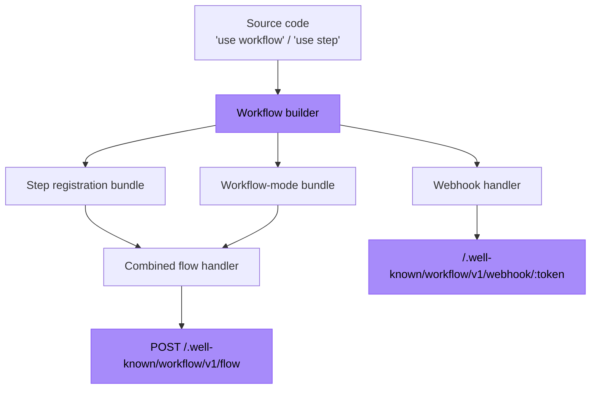

<Callout>
  **For users:** If you just want to use Workflow SDK with an existing framework, see [Getting Started](/docs/getting-started). This page is for framework authors.
</Callout>

This guide uses Bun as a concrete example, but the same build and routing model applies to other JavaScript frameworks and runtimes.

<Callout type="info">
  Read [How the Directives Work](/docs/how-it-works/code-transform) first if you are not familiar with the three compiler modes.
</Callout>

## Integration shape

A framework integration has two responsibilities:

1. **Build time:** transform workflow and step code, register the steps, and generate the combined flow handler.
2. **Runtime:** expose the generated flow and webhook handlers as HTTP routes.



Steps do not have their own HTTP route. A queued step invocation contains `stepId` and `stepName` and is delivered to the flow handler on the workflow queue. The handler executes the registered step in the full host runtime, then replays the workflow in its sandboxed VM.

## Example: Bun integration

### 1. Generate the bundles

The standalone CLI scans `workflows/` and creates the combined flow handler, an internal step registration module, and the webhook handler.

```json title="package.json"
{
  "scripts": {
    "dev": "bun x workflow build && PORT=3152 bun run server.ts"
  }
}
```

The default output is:

- `/.well-known/workflow/v1/flow.mjs` — the combined workflow and step queue consumer
- `/.well-known/workflow/v1/__step_registrations.mjs` — an internal module imported by `flow.mjs`; do not route to it
- `/.well-known/workflow/v1/webhook.mjs` — webhook delivery

<Callout>
  Production integrations should extend `BaseBuilder` from `@workflow/builders` so they can participate in the framework's build, watch, and routing lifecycle.
</Callout>

### 2. Add the app-code transform

Applying the step-mode transform to application code gives it the workflow IDs used by `start()` and prevents accidental direct workflow execution. (Earlier releases used a separate `client` mode for this; it merged into `step` in 5.0.)

{/* @skip-typecheck: incomplete code sample */}
```typescript title="workflow-plugin.ts" lineNumbers
import { plugin } from "bun";
import { transform } from "@swc/core";

plugin({
  name: "workflow-transform",
  setup(build) {
    build.onLoad({ filter: /\.(ts|tsx|js|jsx)$/ }, async (args) => {
      const source = await Bun.file(args.path).text();
      if (!source.match(/(use step|use workflow)/)) {
        return { contents: source };
      }

      const result = await transform(source, {
        filename: args.path,
        jsc: {
          experimental: {
            plugins: [
              [require.resolve("@workflow/swc-plugin"), { mode: "step" }],
            ],
          },
        },
      });

      return { contents: result.code, loader: "ts" };
    });
  },
});
```

Activate the plugin in `bunfig.toml`:

```toml title="bunfig.toml"
preload = ["./workflow-plugin.ts"]
```

### 3. Expose the HTTP routes

Only the combined flow handler and webhook handler are routable:

{/* @skip-typecheck: incomplete code sample */}
```typescript title="server.ts" lineNumbers
import * as flow from "./.well-known/workflow/v1/flow.mjs";
import * as webhook from "./.well-known/workflow/v1/webhook.mjs";

import { start } from "workflow/api";
import { handleUserSignup } from "./workflows/user-signup.js";

const server = Bun.serve({
  port: process.env.PORT,
  routes: {
    "/.well-known/workflow/v1/flow": {
      POST: flow.POST,
    },
    "/.well-known/workflow/v1/webhook/:token": webhook,
    "/": {
      GET: async () => {
        const email = `test-${crypto.randomUUID()}@test.com`;
        const run = await start(handleUserSignup, [email]);
        return Response.json({ runId: run.runId });
      },
    },
  },
});

console.log(`Server listening on http://localhost:${server.port}`);
```

## Runtime routes

### Combined flow endpoint

**Route:** `POST /.well-known/workflow/v1/flow`

The handler consumes every workflow queue message. Depending on the payload and event log, it can:

- start or replay workflow orchestration in the sandboxed VM;
- execute a queued step in the host runtime;
- continue replay inline after a step completes;
- resume a run after a hook, webhook, sleep, retry, or recovery event.

### Webhook endpoint

**Route:** `/.well-known/workflow/v1/webhook/:token`

This handler delivers data to [`createWebhook()`](/docs/api-reference/workflow/create-webhook). Its generated file structure varies by framework; for example, Next.js uses `webhook/[token]/route.js`.

## Building with `BaseBuilder`

Use `createCombinedBundle()` so the flow bundle imports the generated step registrations. Calling `createWorkflowsBundle()` and `createStepsBundle()` independently does not create a complete runtime route.

{/* @skip-typecheck: incomplete framework adapter */}
```typescript title="my-framework-builder.ts" lineNumbers
import { join } from "node:path";
import { BaseBuilder } from "@workflow/builders";

class MyFrameworkBuilder extends BaseBuilder {
  override async build(): Promise<void> {
    const inputFiles = await this.getInputFiles();
    const tsconfigPath = await this.findTsConfigPath();
    const outputDir = join(this.config.workingDir, ".workflow");

    await this.createCombinedBundle({
      inputFiles,
      stepsOutfile: join(outputDir, "__step_registrations.mjs"),
      flowOutfile: join(outputDir, "flow.mjs"),
      tsconfigPath,
      format: "esm",
    });

    await this.createWebhookBundle({
      outfile: join(outputDir, "webhook.mjs"),
    });
  }
}
```

If workflows import sibling workspace packages, set `projectRoot` to the smallest directory containing all imported packages.

{/* @skip-typecheck: partial constructor configuration */}
```typescript
super({
  dirs: ["workflows"],
  workingDir: options.rootDir,
  projectRoot: options.workspaceRoot ?? options.rootDir,
  watch: options.dev,
});
```

Your integration can expose physical files, virtual modules, or framework-native routes. In every case, the step registration module is a dependency of the flow handler, not a route of its own.

## Vercel queue configuration

On Vercel, configure the flow function as the sole queue consumer. `getWorkflowQueueTrigger()` handles the optional queue namespace and `WORKFLOW_SEQUENTIAL_REPLAYS=1` behavior.

```typescript
import { getWorkflowQueueTrigger } from "@workflow/builders";

const flowConfig = {
  maxDuration: "max",
  experimentalTriggers: [getWorkflowQueueTrigger()],
};
```

The generated trigger listens to one topic family:

```json title=".vc-config.json (excerpt)"
{
  "experimentalTriggers": [
    {
      "type": "queue/v2beta",
      "topic": "__wkf_workflow_*",
      "consumer": "default",
      "retryAfterSeconds": 5,
      "initialDelaySeconds": 0
    }
  ]
}
```

Both orchestration messages and step messages use this topic family. A step message is distinguished by its payload, not by a second topic or function.

If you construct the trigger yourself, add `maxConcurrency: 1` when `WORKFLOW_SEQUENTIAL_REPLAYS=1`. The exported `isSequentialReplaysEnabled()` helper implements that build-time check.

## Security

On Vercel, the flow handler uses [queue consumer security](https://vercel.com/docs/queues/concepts#consumer-function-security). For self-hosted worlds, protect the flow and webhook routes with the authentication, network controls, and rate limits appropriate to your queue transport.

## Testing an integration

After a build, verify that:

- the flow handler exists and imports or embeds the step registration bundle;
- the webhook handler exists;
- no step HTTP route or step queue trigger is generated;
- the flow function has the workflow queue trigger and the required maximum duration;
- starting a workflow executes a real step and resumes the workflow.

The flow route exposes a lightweight direct health mode:

```bash
curl -X POST "http://localhost:3000/.well-known/workflow/v1/flow?__health"
```

For an end-to-end queue check, use [`healthCheck()`](/docs/api-reference/workflow-runtime/health-check).
