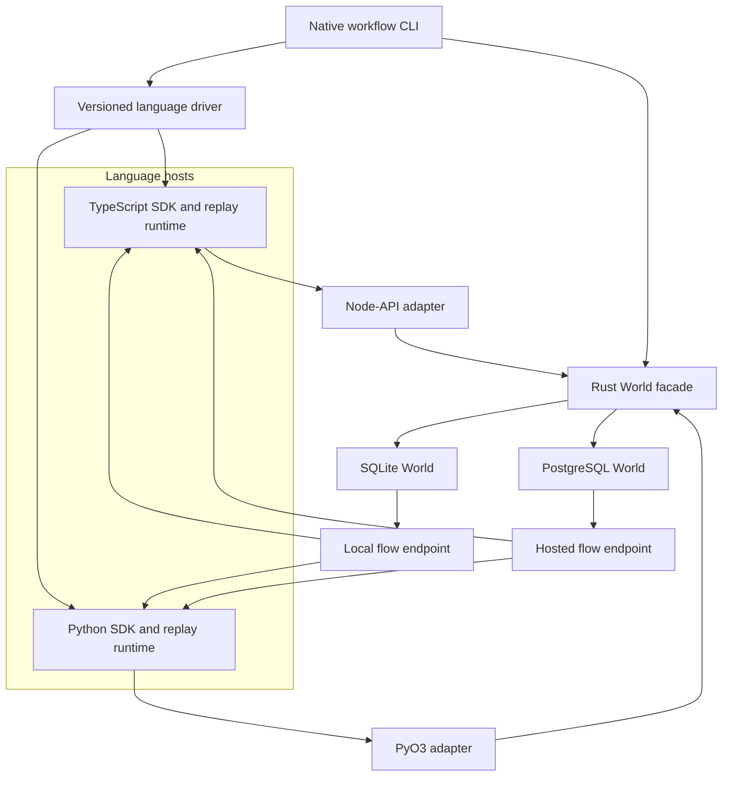

# Rust Portability Architecture

Rust becomes the shared implementation layer for portable tooling and self-hosted Worlds, while language SDKs retain idiomatic APIs and existing JavaScript entry points remain compatible.

## Design Status

This document is an exploratory architecture proposal: it fixes the intended boundaries and sequencing, but leaves implementation choices open where a focused prototype or benchmark is still needed.

The status words used below have precise meanings:

- **Direction** is the working architecture and should change only with a recorded reason.
- **Provisional** is the preferred option, but must be validated before becoming a compatibility promise.
- **Open** identifies a decision that should not be hidden inside an implementation pull request.

The current directions are an in-process Rust library, a new SQLite-backed local profile, thin Node.js and Python bindings, a native CLI kernel with language drivers, and incremental coexistence with the TypeScript implementations.

The decision ledger keeps established boundaries separate from hypotheses that still need evidence:

| Decision | Status |
| --- | --- |
| Rust owns World durability while language SDKs own replay and compilation | Direction |
| The primary integration is an in-process library, not a required daemon | Direction |
| Local persistence moves to a new SQLite format | Direction |
| Node.js uses napi-rs and Python uses PyO3 with thin host adapters | Direction |
| The native CLI delegates language-specific work to versioned drivers | Direction |
| Shared transition logic is a pure, spec-aware plan executed inside backend transactions | Direction |
| First-slice structural types are hand-mapped and checked by shared fixtures | Provisional |
| Node.js and Python adapters exchange host primitives behind a versioned startup handshake | Provisional |
| SQLite uses bundled `rusqlite`, explicit migrations, WAL, and checksummed migration history | Provisional |
| The repository-local probe floor is Rust 1.88 on Linux, macOS, and Windows | Provisional |
| One SQLite file also contains a leased durable local queue | Provisional |
| Loopback HTTP is the semantic-baseline candidate for local queue delivery | Provisional |
| Persisted codec, final FFI encoding, durability defaults, and public package names | Open |
| Native-wheel repository, publisher, and cross-repository release coordination | Open |
| PostgreSQL schema coexistence and replacement for Graphile Worker | Open |
| Legacy local-data importer and timing of default switches | Open |

### Phase 0 Evidence

The first contract slice records what the probes establish without promoting narrow implementation details into compatibility promises.

The shared resilient-run-start fixture is validated against JSON Schema by TypeScript and decoded into independently declared Rust types. This supports hand-mapped structural types plus shared fixtures for the first slice; it does not decide whether a larger contract should later generate types from an IDL.

The Node-API and PyO3 probes pass owned byte buffers and ordinary host scalars into Rust, serialize the small extensible object fields as JSON at the adapter edge, and check adapter protocol version 1 before the first durable call. Returning fixture-shaped JSON is probe instrumentation, not the selected final FFI representation. Cancellation, streams, large-payload measurements, and backpressure remain required before this choice becomes a direction.

The SQLite probe uses `rusqlite` with its bundled SQLite build. Schema changes run only through an explicit migration call under one `BEGIN IMMEDIATE` transaction, enter WAL mode, and record ordered checksums. Concurrent migrators, process death before and after commit, history gaps, future versions, and checksum drift are tested. Runtime operations reject missing or incompatible migration history instead of migrating implicitly.

The leased-queue storage prototype keeps messages in the same SQLite file and scopes claims by an explicit application/deployment identity and queue name. Active-run reconciliation filters by deployment and derives one deterministic message ID per scoped run. Claims use distinct capability tokens, retain the message ID across lease expiry and timeout rescheduling, and are tested across competing and killed processes. This establishes the storage baseline without choosing loopback HTTP or direct binding delivery.

The repository-local technical floor is Rust 1.88 for both native bindings. The dedicated CI matrix is configured to exercise Node.js 22 and Python 3.13 across Linux, macOS, and Windows; the Python extension selects `abi3-py39`, so Python 3.9 is the intended interpreter floor for the probe. This is evidence for the next packaging experiment, not yet the shipped OS, CPU, libc, or language-version support policy.

The current SQLite schema stores opaque application inputs as blobs and limited metadata as checked JSON text for persisted spec 7. It has no legacy JSON/text or `cbor-x` vectors, so it does not close the persisted-codec decision. Queue delivery transport, endpoint resolution, `tag`, database location, busy and checkpoint defaults, wheel ownership, and public package names also remain open.

## Motivation

The current CLI and self-hosted Worlds make Node.js part of the operational substrate even when workflow definitions and their runtime live in another language.

A Python user should not need an npm installation or `npx workflow` merely to inspect or operate workflows. Likewise, every new language SDK should not independently reproduce the local filesystem layout, lock files, PostgreSQL schema, event transition rules, queue retry behavior, and migration tooling.

The duplication is especially dangerous at the World boundary. Correctness depends on the dense-prefix event log, atomic entity materialization, idempotent transitions, stable queue message identity, and crash recovery described in [[worlds]]. Two implementations that expose similar method names but differ on those properties are not compatible Worlds.

Rust is a suitable shared layer because it can produce a standalone CLI, an embeddable library, Node-API modules, and Python extension modules from one implementation. The working model treats Rust as an implementation layer rather than requiring a new user-visible backend identity; public package names remain open.

## Goals

The project succeeds when a language SDK can consume one canonical self-hosted World implementation without reimplementing its durable behavior.

- Provide a zero-Node.js path for Python development using a portable SQLite World.
- Share event transitions, storage semantics, queue behavior, streams, migrations, configuration validation, and stable error codes across languages.
- Produce a standalone `workflow` executable while keeping the `workflow` and `wf` npm bins, including `npx workflow`, operationally compatible.
- Support language-native installation and execution, such as a Python wheel plus an `uvx` or `pipx` entry point, without requiring a Rust toolchain on user machines.
- Preserve the existing public World shape in JavaScript and expose an idiomatic equivalent in Python.
- Keep existing runs and PostgreSQL deployments safe during rolling upgrades and rollback.
- Reach the Python plus SQLite goal through a Node.js-first vertical slice, so the Rust World is proven against this repository's existing tests before cross-repository integration.

## Non-Goals

The initial program deliberately leaves the workflow execution engine and managed backend outside the Rust migration.

- Rewriting deterministic replay, workflow primitives, language compilers, or step execution in Rust is not required.
- Replacing `@workflow/world-vercel` is not required; the native CLI may eventually speak its remote APIs directly.
- Defining a stable C ABI for third-party embedders is not required. The Rust crates and first-party bindings release together.
- Making SQLite a multi-host production database is not a goal. It is a same-machine embedded World.
- Preserving the current local JSON/filesystem layout as the new storage format is not a goal.
- Giving the native CLI built-in knowledge of every language compiler or every community World is not a goal.
- Creating every anticipated crate before its first consumer exists is not a goal.

## Architectural Principles

The migration is governed by a small set of rules that keep language portability from weakening durability.

1. Rust owns durable semantics; bindings own type and runtime adaptation only.
2. User payloads remain opaque bytes to a World, preserving the encryption boundary in [[worlds#Encryption Responsibility]].
3. The persisted run spec, native binding protocol, package version, and database schema version are separate version axes.
4. SQLite and PostgreSQL share a state machine and conformance suite, not necessarily query text or the lowest common SQL abstraction.
5. A native implementation ships beside the TypeScript implementation before it replaces any default.
6. No language callback runs while a database transaction, SQLite writer lock, or internal queue lease mutation is held.
7. Optional capabilities fail closed exactly as described in [[worlds#Capability Negotiation]].
8. Correctness and crash recovery precede throughput optimization.

## Proposed System Shape

The system separates language-owned execution from a shared native persistence plane and gives the CLI explicit escape hatches for language-specific operations.



The HTTP arrows represent queue delivery to the generated flow endpoint described in [[architecture#Request and Queue Boundary]]. A direct in-process delivery path may be added as an optimization, but it must preserve the same envelope, retry, and acknowledgement behavior.

### Ownership Boundaries

Each layer has one primary reason to change, and dependencies point from language adapters toward the durable implementation rather than the reverse.

| Layer | Owns | Does not own |
| --- | --- | --- |
| Language SDK | Replay, workflow/step APIs, compiler or discovery, user-value serialization, framework routes | Database schema, event transition SQL, queue leases |
| Language binding | Dates/bytes/objects, async integration, stream adaptation, native error mapping | Durable validation, retries, migrations, materialization |
| Rust protocol | IDs, event/entity envelopes, queue payloads, pagination, capability and error vocabulary | A language's custom classes or VM |
| Rust World core | Pure, persisted-spec-aware transition planning, shared validation, lifecycle rules, and backend traits | Locks, uniqueness claims, collision retries, or backend-specific transaction syntax |
| Backend crate | Locked reads, linearization, uniqueness, collision retries, connections, transactions, schema, queue, streams, migrations, and notifications | Language-specific objects |
| Native CLI | Command grammar, config discovery, output contract, built-in backend operations, driver dispatch | Language-specific transforms and builds |
| Language driver | Build, transform, validate, and other SDK-specific commands | Global CLI installation or durable World behavior |

The shared state machine is a pure function from a locked snapshot, persisted spec, and requested operation to a mutation plan or stable error. A backend obtains that snapshot, invokes the planner, enforces uniqueness, applies the plan, and commits within one transaction. Calling the planner before the transaction and applying its answer later would create a TOCTOU gap and is not a valid implementation.

This boundary keeps payload serialization and payload encryption/decryption above the World. The optional World key-resolution method remains part of the backend surface and may return or derive key bytes, but the SDK owns their use on application payloads. A Rust CLI that needs to hydrate values either supports a documented portable subset or delegates hydration to the matching language driver; it must not silently guess at language-specific values.

### World Surface Ownership

The existing JavaScript `World` surface crosses several layers, so compatibility requires an explicit owner for each method group rather than treating the whole interface as a database trait.

| World surface | Durable owner | Host adaptation or first-slice rule |
| --- | --- | --- |
| `runs`, `steps`, `events`, and `hooks` storage | Rust backend, with transition plans from Rust core | Binding maps values and errors; optional read methods remain fail-closed |
| Stream read/write/info/close | Rust backend | Binding adapts native cursors to Web streams or Python async iteration |
| `getDeploymentId()` and `queue()` | Rust backend and configuration | Required in every binding; payload bytes and message identity are preserved |
| `createQueueHandler()` | Rust delivery engine plus host adapter | Rust owns attempts, leases, and envelopes; the Node wrapper owns `Request`/`Response`, and Python exposes an idiomatic equivalent |
| `specVersion` and `capabilities` | Rust protocol/backend | Binding reports them without inferring support from method presence or environment variables |
| World `start()` and `close()` lifecycle | Rust engine | Binding delegates explicitly; construction remains side-effect free |
| `getRuntimeDeadline()` | Language/framework host | Passed into Rust only when an operation needs the deadline |
| Deployment availability, latest-deployment resolution, environment, run-ID creation, and run description | Backend-specific extension | Implement only where meaningful; pure metadata methods stay side-effect free |
| `getEncryptionKeyForRun()` | Backend-specific key resolution | Binding returns opaque key bytes; language SDK performs payload encryption/decryption |
| Analytics | Optional backend read surface | Omitted initially; CLI falls back to canonical storage reads |
| Local `tag`, `clear()`, `registerHandler()`, and active-run recovery controls | SQLite profile plus host adapter | May be absent from an experimental package, but each is a compatibility gate before replacing `@workflow/world-local` |

### Library Instead of Required Daemon

The primary integration is an in-process library because local development should not require supervising another service, reserving a port, or negotiating an IPC protocol.

A daemon or sidecar can be added later for languages without a native binding, process isolation, or centralized local workers. It would be another adapter over the same Rust World crates, not the canonical implementation or a prerequisite for Node.js and Python.

## Rust Workspace

The Cargo workspace should express durable boundaries without starting as a collection of empty abstraction crates.

The target dependency graph is:

```text
workflow-protocol
        |
workflow-world-core ----- workflow-world-testkit (dev only)
     |                   |
workflow-world-sqlite   workflow-world-postgres
     \         /
 workflow-world (facade and configuration)
      /             |             \
 Node binding  Python binding  workflow-cli
```

The provisional responsibilities are:

| Crate | Responsibility |
| --- | --- |
| `workflow-protocol` | Language-neutral models, IDs, persisted spec constants, queue envelopes, error codes, and fixture codecs; no I/O |
| `workflow-world-core` | World traits and a pure, persisted-spec-aware transition planner that produces mutation plans or stable errors; no I/O or uniqueness ownership |
| `workflow-world-testkit` | Dev-only operation traces, contract assertions, concurrency schedules, and fault-injection support shared by backend tests |
| `workflow-world-sqlite` | SQLite schema, migrations, transactions, persistent queue, streams, polling, and local configuration |
| `workflow-world-postgres` | PostgreSQL schema compatibility, migrations, transactions, queue implementation, streams, and notifications |
| `workflow-world` | Public Rust facade, backend selection, lifecycle composition, and stable configuration validation |
| `workflow-cli` | Standalone binary, command/output compatibility, built-in backend clients, and language-driver discovery |

Node.js and Python bindings build `cdylib` artifacts, but they are distribution adapters rather than public Rust abstraction layers. A binding stored here joins this Cargo workspace; one stored with an external SDK consumes a pinned native source revision and declares compatibility through the release manifest. The first slice adds only protocol, core, testkit, SQLite, a napi-rs binding deliverable, and a narrow maintenance CLI; the other crates appear when they have executable consumers.

Backend dependencies should be feature-gated so an SQLite-only native package does not inherit PostgreSQL, TLS, or remote-client dependencies. The facade must not turn feature selection into runtime ambiguity: requesting an omitted backend returns a stable unsupported-backend error.

The facade selects an explicit `Sqlite` or `Postgres` backend configuration; it does not infer a database engine from a URL string. Existing JavaScript packages can preselect one backend while Python exposes idiomatic constructors over the same engine.

Opening also requires an explicit role: `Runtime` may read and write but starts workers only when lifecycle `start()` is called, `InspectReadOnly` never creates files, migrates, or claims work, and `MaintenanceExclusive` is reserved for explicit migration, import, or clear operations. Exact type names are provisional, but these permissions are part of the contract.

Two later extraction points are deliberate. A `workflow-client` crate can own `start`, cancel, health, and endpoint negotiation only after those behaviors have a language-neutral protocol. A `workflow-codec` crate can own portable payload hydration only after its supported value set is specified; neither belongs in the World crates or should be created as an empty placeholder.

The graph is logical rather than a final directory decision. Reusable native crates can live under `crates/`, while binding crates may be colocated with the packages that own their loaders and metadata. One Cargo workspace and lockfile is preferable for native code in this repository; it does not imply that separately maintained language SDK repositories move into this monorepo.

The Python SDK currently lives outside this repository. Phase 0 still prototypes PyO3 async, byte, stream, and error boundaries and records viable packaging shapes, but final repository ownership, publishing, version pinning, cross-repository gates, rollback, and `uvx` driver discovery block Phase 3 rather than the Node.js walking skeleton.

The existing Cargo workspace currently targets Rust 1.87 and uses a size-oriented release profile for the SWC/Wasm build. Phase 0 must choose a binding-toolchain version and native release profiles deliberately: [current napi-rs scaffolding](https://napi.rs/docs/introduction/getting-started) documents a newer Rust build requirement, and native database code should not accidentally inherit a Wasm-only optimization policy.

## Language-Neutral World Contract

The TypeScript `@workflow/world` interface is the current executable definition of the World contract, but its `Date`, `Uint8Array`, `ReadableStream`, overloads, and callback types are not themselves a cross-language specification.

The migration must extract a language-neutral contract without creating a second source of truth. Initially, the TypeScript schemas, [[domain-model]], [[worlds]], and shared conformance fixtures remain authoritative; Rust types are tested against them. A later code-generation decision may move the structural schema into an IDL, but behavioral rules still require executable tests.

### Contract Layers

Six related contracts evolve independently and must be named explicitly in errors, manifests, and release notes.

| Contract | Scope | Compatibility rule |
| --- | --- | --- |
| Persisted run spec | Event and queue meaning, state transitions, replay semantics | Stored per run; readers support a range as in [[data-and-compatibility#Protocol Versions]] |
| Persisted codec | Physical encoding of structured event/entity metadata and legacy fallback | Selected by persisted spec or schema state; compatibility is proven with fixed vectors, including existing `cbor-x` data |
| Database schema | Tables, columns, indices, migration state | Backend-specific monotonic migrations with rollback policy |
| Native adapter protocol | Values and operations exchanged between a host wrapper and a Node-API/PyO3 module | Wrapper and native artifact ship in lockstep; handshake before the first durable operation |
| CLI driver protocol | Commands, progress, results, cancellation, and diagnostics exchanged over the driver transport | Independently versioned capability handshake; kernel and driver may come from different packages or repositories |
| Package/CLI version | User-facing features and command behavior | SemVer plus channel policy; never used to infer a run's persisted semantics |

An implementation must never stamp a newer run spec merely because a database migration or native package version increased.

### Canonical Representations

Rust models should remove host-language accidents while round-tripping all stored information.

- Identifiers are validated UTF-8 strings with typed newtypes and unchanged external spelling.
- Timestamps use one documented UTC integer unit internally and convert to JavaScript `Date` or timezone-aware Python `datetime` at the binding edge.
- Serialized application data is an opaque byte buffer plus its existing self-describing prefix; legacy structured JSON remains a versioned compatibility variant.
- Extensible context and metadata use a lossless JSON-like value with explicit byte handling where the current contract permits bytes.
- Event variants are a tagged union. Unknown required variants fail with a newer-protocol error rather than being dropped.
- Pagination cursors are opaque outside the backend that minted them.
- Optional World methods become explicit capabilities internally; a binding exposes or omits the public method according to the language SDK's existing convention.
- Analytics remains an optional read capability. A backend that omits it uses canonical storage reads; it must not advertise synthetic analytics merely to simplify CLI dispatch.

The exact FFI encoding is open. Direct generated structs minimize copies, while a versioned CBOR envelope minimizes duplicated mapping code. A prototype must measure both and exercise bytes, optional fields, large payloads, errors, and stream backpressure before this becomes a direction.

An FFI CBOR envelope, if selected, is not the database codec and must never be confused with existing `cbor-x`-encoded PostgreSQL columns. Likewise, the CLI driver protocol is a process boundary with different evolution and trust properties from an in-process native addon.

Bindings expose a concrete engine with stable data-transfer operations, not a Rust trait object or backend driver's raw SQL API. This keeps Rust dispatch, language ABI, and public SDK interfaces independently evolvable.

### Behavioral Invariants

The Rust trait is incomplete unless it captures behavior that TypeScript method signatures cannot express.

- Events are the mutation API; runs, steps, Hooks, and waits are atomically updated materialized views.
- Event IDs encode a dense, one-based slot within one run, and a failed transaction cannot burn a slot.
- A stale `eventCount` bumps the write above concurrent events and returns a complete skipped-event report; a truncated report cannot advance the caller's observed head.
- Resilient `run_started` may create a missing run and its synthetic `run_created` event atomically.
- Lazy `step_started` may create a missing step and synthetic `step_created` event atomically; only the winning request reports ownership to execute the step body inline.
- Hook receipt/disposal, terminal run transitions, token ownership, wait completion, and resume-id deduplication linearize through storage rather than process-local locks.
- The backend computes and applies each shared transition plan against the same locked snapshot; a plan cannot be cached across a conflicting commit.
- A queue message ID stays stable across redeliveries, delayed work is durable, handler-requested timeouts reschedule rather than acknowledge, and byte payloads remain lossless.
- Stream notifications and database notifications are hints; readers recheck persistent state and release resources when cancelled.
- The exact allowed transition matrix comes from executable fixtures. Rust must not invent a blanket terminal-run rule that rejects transitions the current contract intentionally accepts.

Batch event creation is optional. The first Rust implementation should omit the capability unless one attempt can atomically commit all surviving results in request order and consecutive slots; a loop around single-event creation is not a valid batch implementation.

### Stable Errors

Rust is the authority for backend and transition errors, while each binding raises its language-native exception type.

Every error crossing a binding includes a stable code, safe message, retry classification, and optional structured details. Database-driver strings and credentials never become the compatibility surface. Existing JavaScript error classes and HTTP status behavior map from these codes, and Python receives an equivalent exception hierarchy.

### Evolution Workflow

A World contract change lands in an order that keeps TypeScript, Rust, and future languages synchronized.

1. Specify behavior and backward compatibility in `lat.md` and the public World-building documentation.
2. Add or update language-neutral fixtures and conformance scenarios.
3. Teach old readers to accept the new representation where rolling compatibility requires it.
4. Implement every first-party World and binding that will advertise the capability.
5. Raise the readable ceiling before changing what new runs mint.
6. Enable minting only after cross-version and rollback tests pass.

This is the multi-language form of [[data-and-compatibility#Compatibility Strategy]].

## Native Binding Contract

Bindings should feel native to their host language while remaining intentionally boring: they translate values, futures, streams, and errors around a Rust-owned World instance.

### Node.js Binding

The Node.js adapter uses Node-API through napi-rs so the JavaScript World remains a normal object satisfying the existing `World` interface.

The adapter returns Promises, maps byte buffers without retaining unsafe borrowed memory, turns Rust stream cursors into Web `ReadableStream` instances, and maps structured native errors to the existing JavaScript classes. Per-World connections, tasks, and caches remain instance-owned, preserving [[worlds#World Lifecycle and Module Identity]].

The native module is host-only. Package exports and framework externalization must keep `.node` artifacts out of workflow VM, edge, and client bundles while still allowing build-time access to the small handler/spec surface used by generated routes.

The likely long-term package shape is a thin `@workflow/world-local` or `@workflow/world-postgres` JavaScript facade over platform-specific native packages. An experimental package may precede that switch, but public backend names should describe SQLite/local or PostgreSQL semantics rather than the implementation language.

### Python Binding

The Python adapter uses PyO3 and produces awaitable, typed APIs that fit the Python SDK rather than exposing JavaScript-shaped method overloads.

I/O must release the GIL, cancellation must propagate into Rust tasks where safe, and streams should surface as async iterators or the SDK's stream abstraction. Cleanup is explicit through `close()` and an async context manager; object finalizers are a last-resort safety net, not the lifecycle protocol.

Maturin-built wheels are the provisional distribution mechanism. Python's stable ABI may reduce the wheel matrix, but it becomes a promise only after the chosen PyO3, async runtime, and target set pass import and end-to-end tests.

### Shared Binding Rules

Both bindings obey the same lifetime and concurrency rules even though their host runtimes differ.

- A World instance owns its pool, worker cancellation token, subscriptions, and shutdown state.
- Construction is side-effect free: connections, files, migrations, and worker threads initialize lazily or in `start()`, because framework builds may instantiate a World only to obtain handler metadata.
- `start()` is idempotent; `close()` stops claims, drains or releases in-flight work according to queue policy, closes resources, and makes later operations fail deterministically.
- Rust never invokes a host callback while holding a transaction or internal mutex needed by another World operation.
- Backpressure crosses the binding rather than accumulating unbounded chunks or queue deliveries.
- Panics are caught at the FFI boundary and reported as internal errors; they never unwind into the host runtime.
- A binding reports its native protocol and supported persisted-spec range before the first durable write.

## SQLite Local World

The first backend is a new SQLite database rather than a compatibility layer over the current filesystem World.

SQLite supplies a documented cross-platform file format, transactions, uniqueness constraints, and same-host multi-process locking. This removes the need for every language to reproduce atomic rename, exclusive-link, lock-file recovery, and index-repair behavior.

### Storage Shape

SQLite databases replace per-entity files as the durable unit, but the physical layout for the current tagged overlay remains a Phase 0 decision. The implementation never shards into one database per run.

SQLite manages the journal and shared-memory sidecars when WAL mode is active.

The conceptual schema contains:

- schema metadata and migration history;
- tag/overlay identity if the existing local visibility contract is retained;
- runs and their persisted protocol and storage metadata;
- an append-only event table keyed by `(run_id, position)` with unique event IDs;
- materialized steps, Hooks, and waits;
- Hook-token and resume-id uniqueness state;
- stream metadata and ordered stream chunks;
- durable queue messages, availability times, attempts, leases, and idempotency state.

This list records responsibilities, not final table or column names. SQL names become compatibility surface only after the first migration is released.

The chosen layout must preserve transactional cross-run queries, Hook-token rules, migrations, and queue recovery for the data visible to one World instance. Per-run databases would recreate cross-shard consistency problems without giving a local single-writer SQLite workload useful isolation.

The existing local `tag` option is an overlay rather than an isolated tenant: a tagged World can read untagged and same-tag data while its writes, recovery, and `clear()` are tag-scoped. Phase 0 must first decide whether to preserve that behavior and characterize conflict precedence with fixtures. Compatible layouts include a scope discriminator carried through every relevant key/query/claim or a deliberately designed base-plus-overlay database arrangement; an isolated per-tag database alone is not equivalent. Dropping overlay visibility is an explicit compatibility change.

Application payload fields use SQLite `BLOB` values without hydration. Filterable routing and lifecycle fields remain typed columns. Extensible execution context remains encoded data so adding a context key does not require a schema migration.

### Event Transactions

Each accepted event and its materialized entity update commit in one short write transaction.

For an ordinary append, the backend begins a write transaction, reloads and locks the relevant run and entity state, invokes the pure transition planner for that persisted spec, acquires any uniqueness claim, allocates the next event position, applies the mutation plan, and commits. Allocation in the same transaction keeps the log dense by construction and does not require preallocated holes or `noop` sealing.

Whether the transaction derives the next slot from an indexed maximum or a run-row head is an implementation decision. Either way, allocation and insertion occur in the same transaction; an external sequence, `AUTOINCREMENT`, or pre-commit reservation is invalid unless the backend also implements spec-7 hole sealing.

The returned result still honors [[worlds#Append and Slot Contract]]: if the caller's `eventCount` was stale, the event lands at the next committed slot and the response reports intervening events. A supported batch append validates items independently where the contract permits mixed results, then commits all accepted items in request order and consecutive slots as one atomic attempt; it never exposes a partially committed survivor set.

SQLite has one writer at a time even in WAL mode, so transactions must contain no network calls, language callbacks, sleeps, or payload hydration. Busy handling is bounded, observable, and mapped to a retryable World error after its budget expires.

### Queue

The SQLite profile should use a persistent database queue rather than rebuilding the current in-memory queue in every language.

Enqueue stores the message before returning. Workers atomically claim ready rows with a renewable lease, preserve one stable message ID across redeliveries, increment attempts according to the public queue contract, and acknowledge only after the flow handler succeeds. Process death leaves an expiring lease that another worker can reclaim.

Claims are scoped to the logical deployment, queue namespace, and handler prefixes a worker can actually serve. Replicas for the same target may compete, but a Node.js worker must not consume a Python-targeted job merely because both processes opened the same database. The row stores a logical target and the live worker resolves its current endpoint, avoiding a stale development port after restart.

Delayed delivery, handler-requested `timeoutSeconds`, retry backoff, idempotency windows, queue namespaces, concurrency limits, and graceful shutdown all live in Rust. The provisional baseline transport is loopback HTTP to the language host's generated flow route because it keeps the Rust queue independent of Node.js and Python callback ABIs; Phase 0 still validates it against direct delivery.

A durable queue does not remove the boundary between event creation and publication exposed by the current `World` interface. Queue success with event failure continues to rely on the resilient payload rebuilding missing state; event success with queue failure requires active-run reconciliation. Recovery must use a durable, deterministic idempotency identity and account for ready, delayed, and leased rows so repeated startup scans converge instead of creating a delivery storm.

A future SQLite-specific combined operation may insert an event and message in one transaction, but mixed-version callers and other replay wake paths still require reconciliation. Phase 0 must define which component performs the scan, the identity of a missing wake, and how it coexists with the current `reenqueueActiveRuns` behavior.

A direct in-process handler can be investigated alongside the HTTP baseline. It must use the same serialized envelope and state transitions, and a configuration change between transports must not create two semantic queues. The current public `registerHandler()` optimization may be omitted from an experimental package, but replacing `@workflow/world-local` requires either compatible behavior or a documented removal decision.

### Streams and Long Polls

SQLite persists stream order and completion in tables; process-local notifications only reduce latency and never carry truth.

Readers combine a cursor query with bounded polling so another process's writes are observed even when no in-process signal fires. The same pattern supports `waitForTerminalStatus`: notification is a wake hint, and every wake rechecks durable state. Long reads must end their SQLite read transaction before waiting so they do not starve checkpoints.

### SQLite Configuration

The supported profile is a local file on one host, with configuration chosen for predictable recovery rather than surprising benchmark wins.

- Enable foreign keys and verify required SQLite features at startup.
- Use WAL where the VFS supports it, with a bounded busy timeout and an explicit checkpoint policy.
- Reject or clearly downgrade unsupported VFS behavior instead of assuming WAL was enabled.
- Do not claim support for network filesystems; SQLite's WAL design requires same-host shared memory.
- Bundle or otherwise pin a SQLite build containing the fixes required by the multi-process WAL workload instead of trusting an arbitrary system library.
- Make any reduced-synchronization durability mode an explicit opt-in with documented power-loss behavior.
- Restrict new database and sidecar permissions according to the containing directory and never log secrets or payload bytes.

SQLite's [WAL documentation](https://www.sqlite.org/wal.html) is the reference for same-host concurrency, checkpointing, sidecar handling, and VFS limits. The exact driver, bundled-versus-dynamic linkage, pool size, synchronous mode, and checkpoint thresholds remain benchmark-and-fault-test decisions.

At the time of this proposal, SQLite identifies 3.51.3 and the 3.44.6/3.50.7 backports as containing its multi-connection WAL-reset fix. Release automation should assert a fixed build rather than preserve these particular version numbers as a permanent architectural constant.

### Migrations and Legacy Local Data

Rust owns SQLite migrations, and every binding and the CLI invoke the same migration engine.

Migrations are monotonic, checksummed, transactional where SQLite permits, and protected from concurrent application by a database-level migration lock or equivalent exclusive transaction. Runtime open may apply only migrations explicitly classified as safe and fast; potentially long rewrites require `MaintenanceExclusive` mode and an explicit CLI operation. `InspectReadOnly` validates that it can read the schema but never creates a database or advances it.

The filesystem World and SQLite World use different formats. There is no silent in-place conversion or destructive cleanup. If preserving local runs is valuable, an explicit import command reads the old format, writes a new database, validates counts and event prefixes, and leaves the source untouched. The default-switch plan must decide whether such an importer is release-blocking.

### Prior Art

Existing SQL Worlds are evidence and test inputs, not specifications to copy without checking current contract behavior.

The community [Turso/libSQL World](https://github.com/mizzle-dev/workflow-worlds/blob/d48f8d019fe08ee9c675019160ec0e008eb83cd6/packages/turso/README.md) demonstrates an embedded/remote SQLite-shaped schema, a persistent polling queue, WAL/busy handling, and migration tooling. The reviewed implementation predates dense event slots, separates some event/entity writes, lacks a complete crash-recoverable queue lease, and relies on process-local stream notification, so it is useful prior art rather than a conformance baseline.

The community [Cloudflare World](https://github.com/vinnymac/worlds/blob/8bc96b94503b466bbd4d406a809df15a78e61500/packages/world-cloudflare/README.md) demonstrates per-run transactional state through Durable Objects. Its implementation uses Durable Object key/value APIs rather than a reusable SQL schema, still predates dense slots, and depends on Cloudflare Queues and Workers KV, so its atomic state-transition pattern is more relevant than its storage topology.

Both reviewed community implementations generate ULID event IDs and target older `@workflow/world` contracts. Current dense, one-based per-run slots and spec-7 reading behavior must come from the first-party contract, not from either schema.

The first-party PostgreSQL World remains the closest relational reference for transition and materialization semantics. Conformance comes from shared behavior and fixtures, not from making SQLite imitate PostgreSQL query plans.

## PostgreSQL World

The PostgreSQL rewrite follows the SQLite vertical slice and reuses the protocol and state machine while retaining PostgreSQL-specific concurrency and notification mechanisms.

The storage direction is compatibility-first: a Rust implementation should read existing supported runs and prefer in-place, backward-compatible schema evolution. A default switch requires a tested rolling window in which TypeScript and Rust processes can access the same database without corrupting state, plus a documented rollback point.

### Storage Compatibility

The existing schema and migrations are an installed user asset, so a rewrite may not treat them as internal code that can simply be replaced.

The Rust backend must inventory every table, enum, index, payload encoding, cursor, constraint, and transaction behavior. It can issue different SQL from Drizzle while producing the same committed history and materialized views. If a new schema generation is ultimately justified, it needs an explicit online migration or export/import plan rather than an implicit package upgrade.

Initially, the checked-in PostgreSQL migration SQL should remain the single schema authority and be embedded or invoked with checksum verification by Rust. Maintaining an equivalent Rust migration history beside Drizzle would create two authorities before mixed-version writes are proven.

Existing legacy runs may use a different event-ID scheme and legacy JSON/text columns alongside CBOR columns. Rust must choose behavior from persisted per-run state, preserve that scheme for the run's lifetime, and round-trip the current `cbor-x` representations of dates, missing values, byte arrays, and extensible objects before it can share the installed schema.

### Queue Decision

The PostgreSQL queue is the largest open design item because the current implementation embeds Graphile Worker, whose runtime is JavaScript-specific.

The discovery phase must compare three concrete options: interoperating with the existing Graphile Worker tables and protocol, running a Rust-owned queue in new tables with a rolling drain plan, or temporarily splitting storage into Rust while a legacy Node host adapter, queue bridge, or sidecar continues to run Graphile Worker. A CLI language driver is not a long-lived queue consumer. The choice must account for delayed jobs, stable message IDs, idempotency, leases, graceful shutdown, attempts, namespaces, and old queued messages.

No PostgreSQL implementation should begin by hiding this choice under a generic queue trait. The queue migration and rollback story is a prerequisite for calling the Rust backend a replacement rather than an additional World.

### PostgreSQL-Specific Behavior

PostgreSQL may keep mechanisms that have no useful SQLite equivalent.

LISTEN/NOTIFY can reduce run-status and stream latency while reads remain authoritative. Row locks, unique constraints, statement-level event arbitration, advisory locks where justified, and a connection pool should be designed for multiple hosts. Backend-specific optimizations are valid only when shared conformance proves the same external World behavior.

Concurrent transition code should adopt and test one lock order, provisionally run row, child entity, then event allocation. A collision retry must observe a fresh committed snapshot; changing PostgreSQL isolation levels is a semantic change, not a generic driver tuning knob.

## Native CLI

The portable CLI is a Rust command kernel with built-in backend operations and versioned language drivers for commands that need a language toolchain.

This split lets `workflow` run in a Python-only environment without forcing Rust to understand every compiler. It also preserves JavaScript functionality during migration instead of making a full builder rewrite the entry price for a native executable.

Read-only CLI commands open storage without calling World `start()` or applying an unrequested migration. Commands that claim work, mutate durable state, import data, or change schema make that behavior explicit in their command contract and confirmation policy.

### Command Ownership

Command ownership follows the data and compiler boundary rather than whether the current command happens to be written in TypeScript.

| Command area | Initial owner | Long-term direction |
| --- | --- | --- |
| Help, version, global config, diagnostics | Native kernel | Native kernel |
| SQLite setup/migrate and metadata-only inspect | Native kernel | Native kernel |
| Payload hydration, `--with-data`, `--decrypt`, rich stream display | Language driver | Native only for a specified portable codec |
| PostgreSQL setup/migrate/inspect | Native after backend exists | Native kernel |
| Vercel inspect/cancel/health | Existing JS path or remote client | Native remote client if API contracts support it |
| Community World operations | JavaScript driver in JS projects | Driver/plugin; no arbitrary npm loading in the native process |
| `build`, `transform`, `validate` | JavaScript driver for TS/JS; Python driver for Python | Language driver unless a genuinely shared compiler layer emerges |
| `start`, cancel, workflow health | Driver while client protocols and payload codecs are language-owned | Shared native client after fixed-vector and rollback tests |
| `web` | JavaScript driver while the UI server is Node-based | Native launcher around a separately distributable UI |
| `init`, `dev` | Kernel orchestration plus language driver | Same split |

The existing command names, aliases, flags, JSON output, exit codes, environment precedence, and non-interactive behavior form a compatibility contract. A golden CLI suite should capture them before replacing oclif parsing.

That suite must include the `workflow` and `wf` bins, `npx workflow`, direct execution of `node_modules/workflow/bin/run.js`, stdout/stderr routing, machine-readable JSON or NDJSON, signal and broken-pipe behavior, World shutdown, and current project/manifest discovery. Historical quirks may be changed deliberately, but not accidentally during a parser rewrite.

`start` is intentionally delegated at first because it negotiates persisted spec and endpoint capabilities, dehydrates arguments, selects queue transport, handles compression and encryption, and coordinates a run-created event with a resilient queue publish. Workflow health likewise uses a queue/stream protocol with legacy response forms. They become Rust operations only after a shared client protocol and fixed vectors exist.

### Language Driver Protocol

A driver is an installed, versioned executable or module selected from explicit project metadata and verified discovery rules.

The kernel owns global flags, configuration layering, terminal capabilities, and final exit status. It passes the working directory, untouched language-specific arguments, relevant configuration, and output mode through a versioned structured protocol. The driver first returns its protocol version and capabilities; an incompatible driver fails with an actionable installation command.

The protocol should emit structured progress, diagnostics, result data, and error codes so human and `--json` output remain consistent. It must not require shell command construction, evaluate project code during discovery, or leak all environment variables by default.

Exact project metadata and transport are open. A stdio protocol is provisional because it works across languages, preserves process isolation, and avoids a long-running daemon; a prototype must prove cancellation, signals, large diagnostics, and Windows behavior.

### Distribution

One native source revision feeds several platform artifacts while preserving familiar package-manager entry points; language SDK packages may consume those artifacts from separately coordinated repositories.

- Standalone archives contain the `workflow` executable, `wf` alias or shim, checksums, signatures or attestations, and license data.
- The npm `workflow` and `@workflow/cli` packages become small launchers that select a platform-specific binary package, preserving `npx workflow` without requiring an install-time Rust compiler.
- A Python distribution provides the PyO3 extension and a console entry point suitable for `uvx` or `pipx`; the exact package spelling must be settled with the Python SDK naming.
- Homebrew, Scoop, or similar installers can consume the same signed release archives after the base matrix is reliable.
- `cargo install` may be offered for Rust developers, but it is not the portable default because it requires a toolchain.

Node-API reduces Node.js ABI churn but does not remove the OS, CPU, and libc artifact matrix. Python wheels add interpreter/ABI and platform tags. The CLI executable, Node native module, and Python module are separate artifacts built from one identified Rust commit and tested independently, even if their package tags and repositories differ.

The first supported target matrix should be intentionally small and evidence-based. macOS arm64/x64, Linux x64/arm64 with declared glibc or musl coverage, and Windows x64 are candidates, not promises until clean-install and runtime tests exist.

### Release Coordination

Native artifacts make partial publication a first-class release failure mode.

CI builds and tests every advertised target before publishing npm launchers or a native Python wheel. Consumer packages refer to exact compatible artifact versions. Published artifacts include their Rust commit, native protocol version, persisted-spec range, SQLite version, and enabled backends so support incidents can identify the actual binary.

The existing changeset-driven npm release, Cargo workspace versions, externally maintained Python SDK version, native wheel, and standalone release tag need one machine-readable compatibility manifest and cross-repository gates. A package may advance without advancing the persisted run spec; these operations must remain separate in automation.

## Configuration

Users should see one coherent configuration model whether they entered through Node.js, Python, or the standalone CLI.

Programmatic options override environment variables, which override config files, which override documented defaults unless an existing command already promises different precedence. Parsing and validation live in Rust for backend-owned settings; bindings expose idiomatic constructors without reinterpreting values.

The current npm launcher loads `.env`, then loads `.env.local` with override enabled, so `.env.local` can even replace an inherited process variable. Characterization tests must freeze this fact before the project decides whether the native CLI preserves it or introduces an intentional compatibility break.

Existing environment variables remain supported through the compatibility period. New SQLite or native settings need explicit names, documentation, and secret-redaction tests. The design should converge on a language-neutral project file, but it must not strand framework build-time settings that currently require JavaScript configuration.

Paths are normalized once, resolved relative to a documented base, and displayed before destructive or long-running migration work. CLI commands never infer a database target from an unresolved environment variable for deletion, clearing, or import.

## Compatibility and Migration

The migration is an adapter replacement under stable user-facing contracts, not a flag day for applications or stored runs.

### JavaScript Compatibility

The `workflow` and `wf` bins, `@workflow/world-local`, and `@workflow/world-postgres` remain valid entry points throughout the migration.

Initially, users explicitly select the native implementation. After conformance, the existing packages can become thin facades that select Rust by default and retain a documented legacy filesystem profile for one compatibility window. That profile is not a transparent fallback for a SQLite data directory: engine selection is explicit before opening data. Removing it requires install telemetry or issue evidence, a platform support policy, and a major-version decision if behavior is observably incompatible.

### Persisted Data Compatibility

Compatibility requirements differ between disposable local state and installed PostgreSQL state.

The SQLite profile starts with a new schema and never mistakes a legacy filesystem directory for a database. If both formats exist beneath one configured data root, the user or project configuration selects an explicit profile; ambiguous implicit selection fails before mutation to avoid split-brain runs. PostgreSQL must read all persisted spec versions supported by the matching TypeScript release and must mint the same default spec version. Unknown future runs fail before mutation.

Payload bytes, encryption context, event IDs, correlation IDs, Hook tokens, queue envelopes, and cursors are tested byte-for-byte or semantically as appropriate. The Rust backend may not hydrate and reserialize user data during a storage migration.

### Rolling Upgrade and Rollback

Every default switch has an explicit mixed-version interval and distinguishes implementation rollback from storage-format rollback.

For SQLite, mixed access means multiple Node.js, Python, and CLI processes using one file. A compatible older native implementation can be selected only while it can read the current SQLite schema. Switching back to the filesystem World is not a data rollback: SQLite-created runs are invisible to it.

Before making SQLite the default, the project must explicitly choose whether local data is disposable across that rollback, provide a reverse export, or pay the complexity of dual writes. The working bias is explicit profiles and no dual write, but that becomes a promise only with a migration policy. For PostgreSQL, mixed access also includes old and new queue producers and consumers on different hosts, so schema changes remain backward-readable throughout the declared window and have a documented last safe rollback point.

## Security and Operability

Moving durability into native code changes failure modes but not the system's trust boundary.

Database URLs, auth tokens, encryption material, application payloads, and SQL parameters are redacted from default logs and structured errors. Native dependencies and standalone binaries carry provenance and vulnerability scanning. SQLite files follow restrictive creation permissions, while PostgreSQL TLS behavior is explicit and never silently downgraded.

Rust emits tracing spans and metrics for transaction latency, busy/serialization retries, queue depth and lease recovery, delivery attempts, stream polling, migration duration, and binding-call latency. Bindings connect those signals to the host SDK's OpenTelemetry context where possible, without making observability a prerequisite for correctness.

A panic, poisoned worker, migration mismatch, or incompatible native module fails closed with enough version metadata to diagnose it. Background-task failures are surfaced through health and shutdown APIs rather than printed and forgotten.

## Primary Risks

The program has several cross-cutting risks whose mitigations must exist before a default switch, even when an individual crate appears feature-complete.

| Risk | Architectural mitigation |
| --- | --- |
| TypeScript, Python, and Rust protocol drift | One persisted-spec vocabulary, shared fixtures, exhaustive event handling, and startup range checks |
| Async runtime, GIL, Node event-loop, or shutdown leaks | Thin adapters, instance-owned tasks, explicit cancellation/close, and binding-level tests |
| SQLite corruption, contention, or stuck leased work | Fixed SQLite build, short transactions, durable leases, bounded busy handling, multiprocess crash tests |
| Native artifact missing or loading on the wrong platform | Small advertised matrix, platform packages/wheels, clean-install tests, actionable capability errors |
| CLI behavior differs by installation channel | Native/driver capability handshake and one black-box command/output suite across every launcher |
| PostgreSQL cannot roll back after mixed deployment | Single migration authority, old/new coexistence tests, persisted per-run behavior, explicit queue drain plan |
| Rust accidentally absorbs language-specific payload semantics | Opaque World payloads and a separate, deliberately scoped client/codec layer |

## Verification Strategy

The Rust migration needs one conformance system that can prove backend behavior and cross-language interoperability, not parallel collections of happy-path SDK tests.

### Contract Fixtures

Language-neutral fixtures describe inputs, prior state, operation, expected result or error, and final durable state.

Fixtures cover every event transition, idempotent replay, conflict, stale `eventCount`, dense slots, terminal guards, Hook token retention, resume deduplication, waits, pagination, attributes, legacy spec variants, queue envelopes, and stream boundaries. TypeScript and Rust both consume them so drift is visible before either implementation becomes a reference by accident.

The existing `@workflow/world-testing` suite and backend-specific local/PostgreSQL cases are the first source material for the testkit. They should be made backend-injectable or translated into neutral traces rather than replaced by a smaller Rust-only interpretation.

### Backend Tests

Each backend adds the failure modes its storage engine can actually produce.

SQLite tests use multiple connections and processes, forced busy conditions, process kills around transaction and lease boundaries, WAL recovery, checkpoint pressure, disk-full and permission failures, corrupted or old schema metadata, and concurrent migration attempts. PostgreSQL tests add transaction isolation, pool exhaustion, notifications, network loss, database restart, and mixed old/new worker versions.

The event-log race harness remains a broad probabilistic signal, while direct backend tests stage known races as advised in [[testing#Choosing a Test Level]].

### Binding and Interoperability Tests

Bindings are tested as public SDK surfaces rather than assumed correct because Rust unit tests pass.

Required scenarios include Node.js writing while Python and the CLI read the same SQLite database, Python enqueuing work later delivered after process restart, stable error mapping in both languages, cancellation and shutdown, large byte payloads, stream backpressure, and native-module load failure messages.

The package matrix installs artifacts into clean projects with no compiler present. Tests verify npm launcher selection, `npx workflow`, the `wf` alias, wheel installation, the chosen `uvx` invocation, platform mismatch diagnostics, and checksum/provenance metadata.

### Differential Tests

Where an existing TypeScript World implements the same semantics, a generated operation trace should produce equivalent results and final state in TypeScript and Rust.

Differences in timestamps, generated IDs, physical schema, or pagination encoding are normalized only when the public contract permits them. A normalizer may not hide event order, error classification, status, idempotency, or payload bytes.

## Delivery Sequence

The implementation proves SQLite through Node.js in this repository, completes local E2E, then adds Python interoperability. Defaults change only after repository-local and cross-language evidence exists.

### Phase 0: Contract and Risk Prototypes

This phase creates the minimum shared vocabulary and resolves choices that could invalidate the architecture.

- Inventory the current World API, local extensions, persisted spec versions, event transitions, queue contract, and relevant TypeScript tests.
- Add language-neutral fixtures around run creation, event slots, steps, Hooks, waits, and terminal transitions across the minimum and current supported specs.
- Add fixed vectors for legacy PostgreSQL JSON/text and `cbor-x` metadata before SQLite choices harden the shared protocol or transition planner.
- Prototype Node-API and PyO3 async calls, byte transfer, errors, cancellation, and stream iteration.
- Prototype a multi-process SQLite append, scoped leased queue claim, crash recovery, and active-run reconciliation without duplicate amplification.
- Decide the structural source of truth, persisted SQLite codec, FFI representation, SQLite driver/linkage, tag storage model, queue delivery topology, and initial target matrix.
- Record viable ownership and release shapes for the native Python wheel and its external SDK consumer without making that cross-repository decision block the Node.js slice.

Exit requires a written decision for each prototype and one fixture executed by both TypeScript and Rust.

### Phase 1: Node.js and SQLite Walking Skeleton

This phase proves the Rust World architecture inside the current repository before introducing a cross-repository integration variable.

Implement protocol/core/SQLite crates, migrations, run/event/step storage, a minimal durable queue, the napi-rs adapter, and an experimental JavaScript World package. Prove addon loading and a minimal durable operation through the JavaScript World surface, and add a narrow native maintenance CLI with `version`, `doctor`, explicit SQLite migration, and metadata-only inspection. The implementation is experimental and opt-in; it does not replace the current local default.

Exit requires dense event-log and process-restart tests through the Node.js binding, a JavaScript contract smoke test, and read-only CLI inspection that neither migrates nor consumes work. Full workflow E2E and clean-install coverage belong to Phase 2.

### Phase 2: Complete Portable Local World

This phase closes the semantic gaps that a walking skeleton can avoid and proves the Rust local World against this repository's real runtime.

Add all events and optional capabilities intended for launch, durable streams, long polling, Hook retention and resume deduplication, delayed jobs, retries, lease recovery, concurrency limits, observability, cleanup, and the complete conformance suite. Close or explicitly defer the compatibility gaps for local `tag`, `clear()`, `registerHandler()`, and active-run recovery, then inject the experimental package into the TypeScript workbench, compare it behaviorally with the filesystem World, and measure Node.js startup, bundle, memory, and queue costs.

Exit requires the applicable local core E2E corpus, direct concurrency and crash tests, queue lease recovery, the event-log race harness, clean npm installation without a Rust toolchain, and a documented SQLite support policy, all runnable without a Python repository checkout.

### Phase 3: Python Binding and Cross-Language Use

This phase proves that the repository-local Rust implementation is genuinely portable infrastructure rather than a Node.js-specific backend.

Add the PyO3 adapter and Python SDK integration using the Phase 0 technical spike, then run TypeScript and Python against databases created by either binding and prove Python queue delivery across process restart. Establish cross-repository compatibility gates and measure Python packaging, startup, memory, queue, and stream behavior without weakening the Node.js baseline.

Exit requires a Python end-to-end workflow, Node/Python/CLI interoperability, a clean wheel install with no Rust or Node.js toolchain, working cross-repository gates and rollback metadata, and no unsupported fallback hidden by the test environment.

### Phase 4: Native CLI and Distribution

This phase makes the portable executable the command entry point while keeping language-specific command implementations available through drivers.

Expand the maintenance shell into the command kernel, complete config and output compatibility, add the driver handshake, standalone archives, npm launchers, and the Python console entry point, and migrate commands incrementally according to the command-ownership table.

Exit requires golden command tests and installation smoke tests for every advertised platform and invocation path.

### Phase 5: PostgreSQL Backend

This phase ports the multi-host self-hosted World only after the shared contracts and release machinery are proven by SQLite.

Complete the schema and queue compatibility design, implement the PostgreSQL crate, run differential and mixed-version tests, and provide setup/migration/rollback commands through the native CLI.

Exit requires existing-run compatibility, queued-message migration or draining, rolling old/new deployment tests, and failure recovery under database and process restarts.

### Phase 6: Adoption and Cleanup

This phase changes defaults only where support evidence justifies it.

Promote the native facades, preserve an announced legacy-profile window, document legacy local-data handling, and later remove superseded TypeScript implementation code. Each removal is a separate decision; completing a Rust implementation does not automatically authorize deleting its predecessor.

## Open Decisions

The remaining questions are ordered by when they can block useful work.

### Blocking the First Slice

These decisions must be resolved during Phase 0.

1. What is the structural source of truth: an IDL with generated host types or hand-mapped types checked by shared fixtures?
2. What persisted codec represents new SQLite event/entity metadata, and which fixed vectors define legacy JSON/text and `cbor-x` compatibility while application payload bytes remain opaque?
3. Does the native adapter use mapped host structs or a versioned envelope, and what handshake detects a wrapper/addon mismatch before a write?
4. Which Rust SQLite driver and linkage mode provide the required async behavior, patched SQLite version, build portability, and test hooks?
5. Does the initial worker deliver over loopback HTTP, a direct binding callback, or both, and which path is the semantic baseline?
6. What stable application/deployment identity scopes queue claims, how does a worker resolve its current endpoint, and what deterministic identity makes active-run reconciliation converge?
7. Must local `tag` preserve its current untagged-plus-tagged overlay visibility, conflict precedence, scoped recovery, and scoped `clear()`; if so, does one database carry scope keys or does the layout use a designed base-plus-overlay arrangement?
8. What durability, busy-timeout, connection-count, and checkpoint defaults are appropriate for the local profile?
9. Where does the SQLite file live, and how does `WORKFLOW_LOCAL_DATA_DIR` map to it without colliding with legacy files?
10. What minimum Rust, Node.js, OS, CPU, libc, and SQLite matrix is blocking for the repository-local slice?

### Blocking Python Integration

Phase 0 must prove PyO3 feasibility, but these product and cross-repository choices need resolution only before Phase 3 begins.

1. Where are the PyO3 crate and native wheel built and published, and how does the external Python SDK pin a compatible artifact?
2. Which Python versions, ABI strategy, platforms, async runtime, stream mapping, and cancellation behavior form the supported binding contract?
3. How do cross-repository CI, compatibility metadata, and rollback prevent either repository from publishing an unusable pair?
4. What is the exact PyPI package and console-script spelling, and how does an isolated `uvx` process discover the project SDK or Python driver?

### Blocking CLI Compatibility

These decisions can wait until the SQLite World is operational but precede the native CLI default.

1. What project metadata selects a language driver, and how are monorepos or mixed-language projects handled?
2. Which commands and flags are frozen from the oclif CLI before cleanup is allowed?
3. Can `start` define a language-neutral client contract, including opaque binary payloads, serialization, compression, encryption, and deployment lookup?
4. How are native binaries and language packages versioned and published without a partially available release?

### Blocking PostgreSQL Replacement

These decisions should not constrain the SQLite design prematurely, but they must be explicit before PostgreSQL implementation begins.

1. Must the Rust backend use the existing PostgreSQL schema in place, and for how long must old code be able to write it?
2. Is Graphile Worker interoperability sustainable, or does the queue need a new Rust-owned schema and drain protocol?
3. Which migrations are online and reversible across mixed Rust/TypeScript deployments?
4. Which PostgreSQL capabilities are required at first release versus introduced after parity?

### Safe to Defer

These options do not block the first useful Node.js/SQLite result or the later Python target.

- A public stable Rust API or C ABI.
- A required daemon/sidecar mode.
- Bindings for languages beyond Node.js and Python.
- Rewriting the Vercel World, workflow VM, or compilers in Rust.
- Automatic conversion of disposable legacy local data.
- A single universal package containing every database backend.

## Rejected Starting Points

Several tempting approaches create early motion at the cost of the shared architecture.

- A line-for-line port of `world-local` preserves the lock-file complexity the project is trying to remove.
- A language-specific SQLite reimplementation immediately creates the next duplicated World.
- A mandatory daemon exchanges binding work for supervision and IPC work in every local project.
- One generic SQL repository for SQLite and PostgreSQL tends to hide engine-specific concurrency requirements and makes the weaker database dictate both designs.
- A complete CLI rewrite before a driver boundary is proven either drops TypeScript build commands or pulls the whole JavaScript builder into the native binary design.
- An automatic local-data migration risks destroying development state and makes rollback ambiguous.
- Replacing PostgreSQL storage without a queue migration plan leaves old durable jobs as an unowned protocol.

## First Decision Package

The next discussion should approve a small decision package that unlocks the Node.js/SQLite walking skeleton without pretending the full program is settled.

That package consists of the ownership boundary, the pure transition-plan model, the initial crate graph, SQLite as a new explicitly selected local format, a persistent SQLite queue direction, napi-rs as the first integrated binding, Phase 2 validation through the existing TypeScript E2E paths, TypeScript coexistence, and Phase 0 prototypes for both Node-API and PyO3 plus the persisted codec, FFI representation, SQLite driver, queue routing, reconciliation, and delivery transport. Loopback HTTP is the baseline candidate, not yet an approved compatibility promise. Python packaging, public package names, PostgreSQL queue design, and default replacement remain open.
