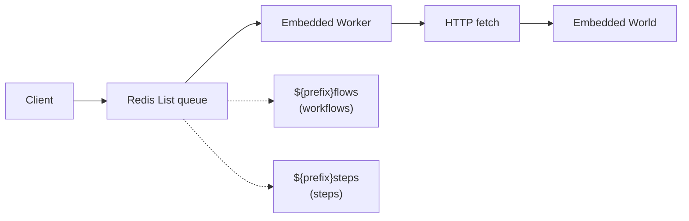

# How Postgres + Redis World Works

This document explains the architecture and components of the Postgres + Redis world implementation for workflow management.

This implementation is using [Drizzle Schema](./src/drizzle/schema.ts) that can be pushed or migrated into your PostgreSQL schema and backed by Postgres.js.

If you want to use any other ORM, query builder or underlying database client, you should be able to fork this implementation and replace the Drizzle parts with your own.

## Job Queue System (Redis Lists + Pub/Sub)



Jobs include idempotency keys and configurable worker concurrency (default: 10). Workers RPOP from lists and block using lightweight Pub/Sub to avoid hot loops.

## Streaming (Redis Streams)

Real-time data streaming via **Redis Streams**:

- Chunks appended with `XADD` to a per-stream key
- Consumers read with blocking `XREAD`; optional fast-forward via `XRANGE COUNT`
- An explicit EOF entry (`eof = '1'`) signals stream completion
- Payloads are base64-encoded to carry binary safely

## Setup

Call `world.start()` to start background queue workers. Workers begin listening to Redis queues and forward messages to the embedded world endpoints (`.well-known/workflow/v1/flow` or `.well-known/workflow/v1/step`).

In **Next.js**, the `world.setup()` function needs to be added to `instrumentation.ts|js` to ensure workers start before request handling:

```ts
// instrumentation.ts

if (process.env.NEXT_RUNTIME !== "edge") {
  import("workflow/api").then(async ({ getWorld }) => {
    // start listening to the jobs.
    await getWorld().start?.();
  });
}
```

