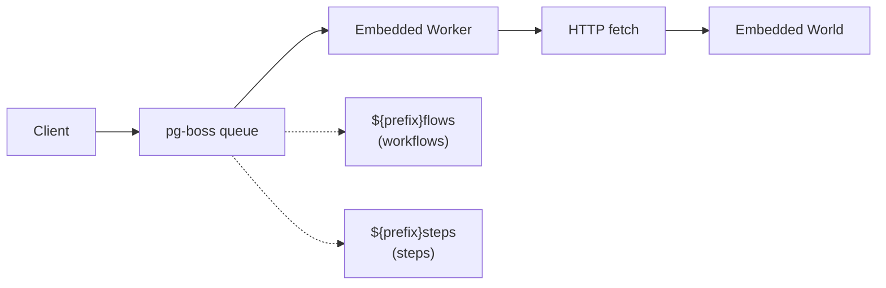

# How PostgreSQL World Works

This document explains the architecture and components of the PostgreSQL world implementation for workflow management.

This implementation is using [Drizzle Schema](./src/drizzle/schema.ts) that can be pushed or migrated into your PostgreSQL schema and backed by Postgres.js.

If you want to use any other ORM, query builder or underlying database client, you should be able to fork this implementation and replace the Drizzle parts with your own.

## Job Queue System



Jobs include retry logic (3 attempts), idempotency keys, and configurable worker concurrency (default: 10).

## Streaming

Real-time data streaming via **PostgreSQL LISTEN/NOTIFY**:

- Stream chunks stored in `workflow_stream_chunks` table
- `pg_notify` triggers sent on writes to `workflow_event_chunk` topic
- Subscribers receive notifications and fetch chunk data
- ULID-based ordering ensures correct sequence
- Single connection for listening to notifications, with an in-process EventEmitter for distributing events to multiple subscribers

## Setup

Call `world.start()` to initialize pg-boss workers. When `.start()` is called, workers begin listening to pg-boss queues. When a job arrives, workers make HTTP fetch calls to the embedded world endpoints (`.well-known/workflow/v1/flow` or `.well-known/workflow/v1/step`) to execute the actual workflow logic.

In **Next.js**, the `world.setup()` function needs to be added to `instrumentation.ts|js` to ensure workers start before request handling:

```ts
// instrumentation.ts

if (process.env.NEXT_RUNTIME !== "edge") {
  import("workflow/api").then(async ({ getWorld }) => {
    // start listening to the jobs.
    await getWorld().start?.();
  });
}
```

