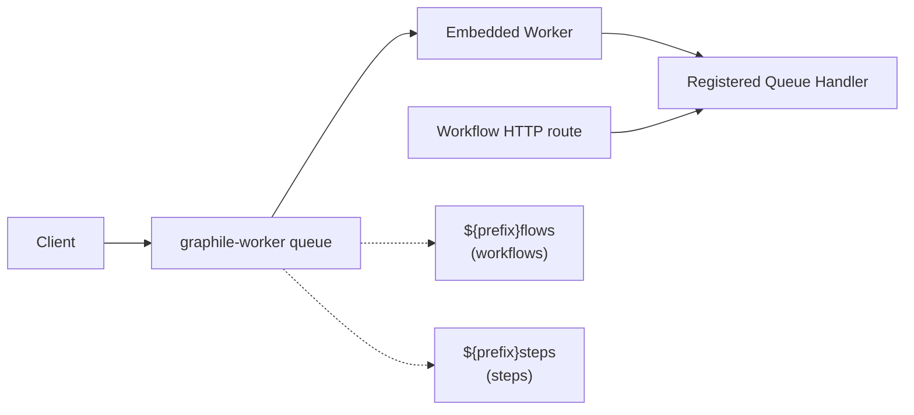

# How PostgreSQL World Works

This document explains the architecture and components of the PostgreSQL world implementation for workflow management.

This implementation is using [Drizzle Schema](./src/drizzle/schema.ts) that can be pushed or migrated into your PostgreSQL schema and backed by [node-postgres](https://node-postgres.com/) (`pg`). `createWorld` uses a single `pg.Pool` for Drizzle and graphile-worker (via `pgPool`), and a dedicated `pg.Client` for LISTEN/NOTIFY derived from the same connection options. You may pass your own pool to share query connections with application code.

If you want to use any other ORM, query builder or underlying database client, you should be able to fork this implementation and replace the Drizzle parts with your own.

## Job Queue System


```mermaid
graph LR
    Client --> PG[graphile-worker queue]
    PG --> Worker[Embedded Worker]
    Worker --> Handler[Registered Queue Handler]
    Route[Workflow HTTP route] --> Handler

    PG -.-> F["${prefix}flows<br/>(workflows)"]
    PG -.-> S["${prefix}steps<br/>(steps)"]
```

Jobs include retry logic (3 attempts), idempotency keys, durable delayed rescheduling, and configurable worker concurrency (default: 50).

## Streaming

Real-time data streaming via **PostgreSQL LISTEN/NOTIFY**:

- Stream chunks stored in `workflow_stream_chunks` table
- `pg_notify` triggers sent on writes to `workflow_event_chunk` topic
- Subscribers receive notifications and fetch chunk data
- ULID-based ordering ensures correct sequence
- One long-lived dedicated `LISTEN` client, with an in-process EventEmitter for distributing events to multiple subscribers

## Setup

Call `world.start()` to initialize graphile-worker utilities and migrations. Startup can durably enqueue work before the application HTTP listener is accepting connections.

Graphile workers begin consuming after migrations finish. Unless `WORKFLOW_LOCAL_BASE_URL` selects a remote executor, each job resolves its registered queue handler and calls it directly in-process. Resolving per job means handlers registered later are picked up without restarting the worker.

If a job arrives before its generated route module has loaded, the job probes that route's health endpoint. When the application is not listening yet, the worker durably replaces the job with a short-delay job before acknowledging the current delivery. When the route is healthy but has not registered its handler, the worker delivers over HTTP so applications using an older runtime continue processing.

When the runtime returns `{ timeoutSeconds }`, the worker schedules a new Graphile job with a future `runAt` time before finishing the current task.

The generated HTTP routes still use the same queue handler wrapper for external route requests. Embedded Graphile workers normally call registered handlers directly; local routes without proactive registration fall back to HTTP, and explicit `WORKFLOW_LOCAL_BASE_URL` worker processes always execute remotely over HTTP.


In **Next.js**, add the `world.start()` call to `instrumentation.ts|js` so Graphile is initialized and active runs are re-enqueued during application startup. Use `workflow/runtime` for `getWorld` (same as the testing server and other framework plugins):

```ts
// instrumentation.ts

if (process.env.NEXT_RUNTIME !== "edge") {
  import("workflow/runtime").then(async ({ getWorld }) => {
    // start listening to the jobs.
    const world = await getWorld();
    await world.start?.();
  });
}
```
