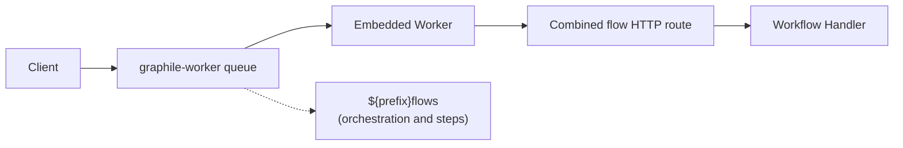

# How PostgreSQL World Works

This document explains the architecture and components of the PostgreSQL world implementation for workflow management.

This implementation is using [Drizzle Schema](./src/drizzle/schema.ts) that can be pushed or migrated into your PostgreSQL schema and backed by [node-postgres](https://node-postgres.com/) (`pg`). `createWorld` uses a single `pg.Pool` for Drizzle and graphile-worker (via `pgPool`), and a dedicated `pg.Client` for LISTEN/NOTIFY derived from the same connection options. You may pass your own pool to share query connections with application code.

If you want to use any other ORM, query builder or underlying database client, you should be able to fork this implementation and replace the Drizzle parts with your own.

## Job Queue System


```mermaid
graph LR
    Client --> PG[graphile-worker queue]
    PG --> Worker[Embedded Worker]
    Worker --> HTTP[Combined flow HTTP route]
    HTTP --> Handler[Workflow Handler]

    PG -.-> F["${prefix}flows<br/>(orchestration and steps)"]
```

Jobs include retry logic (3 attempts), idempotency keys, durable delayed rescheduling, and configurable worker concurrency (default: 10).

## Streaming

Real-time data streaming via **PostgreSQL LISTEN/NOTIFY**:

- Stream chunks stored in `workflow_stream_chunks` table
- `pg_notify` triggers sent on writes to `workflow_event_chunk` topic
- Subscribers receive notifications and fetch chunk data
- ULID-based ordering ensures correct sequence
- One long-lived dedicated `LISTEN` client, with an in-process EventEmitter for distributing events to multiple subscribers

## Setup

Call `world.start()` to initialize graphile-worker workers. When `.start()` is called, workers begin listening to graphile-worker queues. When a job arrives, the worker executes the queue message over the workflow HTTP routes and awaits completion before acknowledging the Graphile job.

When the runtime returns `{ timeoutSeconds }`, the worker schedules a new Graphile job with a future `runAt` time before finishing the current task.

The worker sends workflow orchestration and queued step messages to the combined `.well-known/workflow/v1/flow` endpoint.

That endpoint is not authenticated: the queue HTTP handler is inherited from `@workflow/world-local` and checks the `x-vqs-*` header shape and the queue-name prefix, but never the caller, so restricting the route is left to the deployment. The payload is validated later, by the runtime that consumes the message. See [Security](./README.md#security).

In **Next.js**, the `world.start()` call needs to be added to `instrumentation.ts|js` to ensure workers start before request handling. Use `workflow/runtime` for `getWorld` (same as the testing server and other framework plugins):

```ts
// instrumentation.ts

if (process.env.NEXT_RUNTIME !== "edge") {
  import("workflow/runtime").then(async ({ getWorld }) => {
    // start listening to the jobs.
    const world = await getWorld();
    await world.start?.();
  });
}
```

## Lost workers

Graphile Worker 0.16 ends a worker whose job release (completeJob or failJob) fails with an error it does not retry, such as a dropped or refused connection, or with a retryable error that outlasts its 100 retries. It logs "committing seppuku" and never replaces the worker, and the runner's `promise` does not settle. A runner left alone would lose a worker on each database failover that a job finishes across, until it claimed nothing.

The queue watches each runner it starts for `worker:fatalError`:

- **Replacement.** On a runner's first loss, the queue starts a new runner with the same options. It stops the old runner only once the new one is up: a start needs a connection, because Graphile Worker migrates first, and meanwhile the old runner's remaining workers keep retrying their fetches through the outage. A failed start is tried again after 1s, doubling to 30s. One start runs at a time, however long connecting takes: a runner that came up late beside another would run the jobs its workers had already claimed on top of the other's. A replacement that is itself lost within 30s of starting is replaced only after the next of those steps. Releases that keep failing while fetches succeed would otherwise start runners as fast as jobs are claimed, each worker stranding a job; this way such a database costs at most one runner every 30s. The active-run recovery that `world.start()` runs is not repeated.
- **Failed runners.** Graphile Worker stops a runner whose cron or worker pool fails, as when the crontab query every runner makes at start meets a database that is going away, and rejects its `promise`. The queue replaces such a runner the same way, and leaves Graphile Worker to stop it with its usual abort of the jobs it is running.
- **Stopping runners.** A runner that is stopping, through `world.close()` or Graphile Worker's own shutdown (its `stop`, `pool:gracefulShutdown` and `pool:forcefulShutdown` events), is not replaced, and a replacement under way gives up once the old runner stops. Once a signal is shutting the runners down, nothing is replaced.
- **The retired runner's jobs.** Graphile Worker aborts a stopping runner's task signals after its grace period (5s, which the queue passes as `gracefulShutdownAbortTimeout`). A retired runner's jobs are healthy, so their deliveries do not follow that signal; they finish and are recorded as usual, and until they do, the process can run more than `queueConcurrency` jobs. Only the latest retired runner's deliveries run without a time limit: the queue aborts an older one's 5s after a newer one is retired, and every retired runner's 5s after `world.close()` stops the active runner. Graphile Worker's signal handling (its `gracefulShutdown` and `forcefulShutdown` events) does not wait for a retired runner, whose pool is already shutting down; it exits the process once the active runner's jobs end. So on a signal the queue aborts retired runners' deliveries at once, which usually fails their jobs for a retry before the exit. With `applicationManagedShutdown`, awaiting `world.close()` waits for them.
- **`world.close()`.** It stops the active runner first. Then it waits for replacements still starting, retiring the runner each brings up, and for retired runners to finish their jobs, before it releases the worker utils. As with stopping the active runner, which queries the database, this wait is not bounded against a database that stops responding.
- **Reporting.** Each loss is passed to `onWorkerLost`. An error it throws or rejects with is logged.

Unless the release committed before it failed, the job stays locked until Graphile Worker resets locks older than 4 hours, which it checks every 8 to 10 minutes. With `enableInvoke`, the run's executor queue stays locked with it, so that run's other executions wait too. Once unlocked, the job runs again, even if its delivery had finished.

## Shutdown

`world.close()` first stops Graphile Worker from claiming new jobs, then waits for active jobs before closing the streamer and any internally owned pool.

Graphile Worker gives active tasks a grace period, then aborts their task signal. The Postgres world forwards that signal to both the workflow HTTP request and its response body. If the request aborts, Graphile Worker unlocks the same Postgres job row through its normal failure handling. The already-claimed delivery consumes an attempt and is retried only if its Graphile attempt budget remains; the shutdown handler does not insert a successor row.

Applications that manage a broader shutdown sequence should set `WORKFLOW_POSTGRES_APPLICATION_MANAGED_SHUTDOWN=1` for the standard package target or `applicationManagedShutdown: true` for a programmatic World, await `world.close()`, and only then close the workflow HTTP routes and any caller-owned pool. This prevents Graphile Worker's default handler from terminating the process as soon as its queue stops. Because aborting a client request does not prove that its server handler stopped, workflow and step handlers still need to tolerate at-least-once execution.
