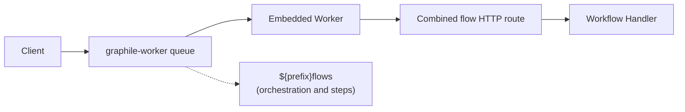

# How PostgreSQL World Works

This document explains the architecture and components of the PostgreSQL world implementation for workflow management.

This implementation is using [Drizzle Schema](./src/drizzle/schema.ts) that can be pushed or migrated into your PostgreSQL schema and backed by [node-postgres](https://node-postgres.com/) (`pg`). `createWorld` uses a single `pg.Pool` for Drizzle and graphile-worker (via `pgPool`), and a dedicated `pg.Client` for LISTEN/NOTIFY derived from the same connection options. You may pass your own pool to share query connections with application code.

If you want to use any other ORM, query builder or underlying database client, you should be able to fork this implementation and replace the Drizzle parts with your own.

## Job Queue System


```mermaid
graph LR
    Client --> PG[graphile-worker queue]
    PG --> Worker[Embedded Worker]
    Worker --> HTTP[Combined flow HTTP route]
    HTTP --> Handler[Workflow Handler]

    PG -.-> F["${prefix}flows<br/>(orchestration and steps)"]
```

Jobs include retry logic (3 attempts), idempotency keys, durable delayed rescheduling, and configurable worker concurrency (default: 10).

## Streaming

Real-time data streaming via **PostgreSQL LISTEN/NOTIFY**:

- Stream chunks stored in `workflow_stream_chunks` table
- `pg_notify` triggers sent on writes to `workflow_event_chunk` topic
- Subscribers receive notifications and fetch chunk data
- ULID-based ordering ensures correct sequence
- One long-lived dedicated `LISTEN` client, with an in-process EventEmitter for distributing events to multiple subscribers

## Setup

Call `world.start()` to initialize graphile-worker workers. When `.start()` is called, workers begin listening to graphile-worker queues. When a job arrives, the worker executes the queue message over the workflow HTTP routes and awaits completion before acknowledging the Graphile job.

When the runtime returns `{ timeoutSeconds }`, the worker schedules a new Graphile job with a future `runAt` time before finishing the current task.

The worker sends workflow orchestration and queued step messages to the combined `.well-known/workflow/v1/flow` endpoint.

That endpoint is not authenticated: the queue HTTP handler is inherited from `@workflow/world-local` and checks the `x-vqs-*` header shape and the queue-name prefix, but never the caller, so restricting the route is left to the deployment. The payload is validated later, by the runtime that consumes the message. See [Security](./README.md#security).

In **Next.js**, the `world.start()` call needs to be added to `instrumentation.ts|js` to ensure workers start before request handling. Use `workflow/runtime` for `getWorld` (same as the testing server and other framework plugins):

```ts
// instrumentation.ts

if (process.env.NEXT_RUNTIME !== "edge") {
  import("workflow/runtime").then(async ({ getWorld }) => {
    // start listening to the jobs.
    const world = await getWorld();
    await world.start?.();
  });
}
```

## Crash recovery

graphile-worker 0.16 sets a job's `locked_at` once, when a worker claims it, and only resets locks older than a fixed 4 hours. On its own, a worker that dies mid-delivery would keep its job locked for 4 hours, and a healthy delivery that runs longer than that would be reset and delivered twice.

When `jobLockStaleSeconds` is set (it is `0`, off, by default), the queue renews the lock of every delivery it is running (`src/job-lease.ts`): one batched `UPDATE` of `graphile_worker._private_jobs.locked_at`, and of the job's named queue in `_private_job_queues` (invoke mode's per-run executor queue), fenced on the worker that claimed it, every quarter of `jobLockStaleSeconds` and at least every 10 seconds. Every process with a running Graphile runner also runs Graphile Worker's own stale-lock reset with a `jobLockStaleSeconds` window, scoped to this World's task identifiers so that other applications sharing the `graphile_worker` schema keep their locks. Both statements use the database clock.

A renewal that no longer finds its job means the job was released for redelivery. The delivery then fails instead of completing when it finishes: Graphile Worker completes a job with a delete that is not fenced on the lock holder, so completing could delete a successor's row, whereas failing is fenced and changes nothing. If no renewal has shown the lock to be held within half the window, the delivery renews once more before it completes. After a failed renewal or release (a database outage), a process's next release only checks that the database is back, so that holders can renew before their jobs are released.

It's off by default because of rolling upgrades: a process on an earlier version neither renews its locks nor fences its acknowledgement, so turning this on while such a process shares the database could delete the redelivered job of one of its long deliveries. The README's [Crash recovery](./README.md#crash-recovery) section covers turning it on.

## Shutdown

`world.close()` first stops Graphile Worker from claiming new jobs, then waits for active jobs before closing the streamer and any internally owned pool.

Graphile Worker gives active tasks a grace period, then aborts their task signal. The Postgres world forwards that signal to both the workflow HTTP request and its response body. If the request aborts, Graphile Worker unlocks the same Postgres job row through its normal failure handling. The already-claimed delivery consumes an attempt and is retried only if its Graphile attempt budget remains; the shutdown handler does not insert a successor row.

Applications that manage a broader shutdown sequence should set `WORKFLOW_POSTGRES_APPLICATION_MANAGED_SHUTDOWN=1` for the standard package target or `applicationManagedShutdown: true` for a programmatic World, await `world.close()`, and only then close the workflow HTTP routes and any caller-owned pool. This prevents Graphile Worker's default handler from terminating the process as soon as its queue stops. Because aborting a client request does not prove that its server handler stopped, workflow and step handlers still need to tolerate at-least-once execution.
